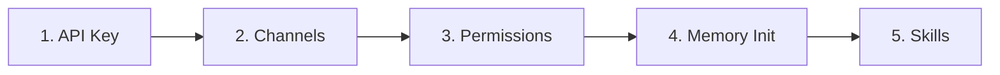

# Module 01: Getting Started

> **Level:** Beginner | **Time:** 45 minutes | **Prerequisites:** None

Install OpenClaw, configure your first LLM provider, and have your first conversation with your AI assistant.

---

## What You'll Learn

- How to install OpenClaw on macOS, Linux, and Windows
- How to configure your LLM provider (API key setup)
- How to run the onboarding wizard
- How to navigate the Control UI dashboard
- How to have your first productive interaction

---

## Installation

### Prerequisites

| Requirement | Minimum Version | Recommended |
|---|---|---|
| Node.js | 22.14 (LTS) | 24.x |
| npm | 10.x | Latest |
| OS | macOS 13+, Ubuntu 22.04+, Windows 11 (WSL2) | macOS 14+ |
| RAM | 4 GB | 8 GB+ |
| Disk | 500 MB | 2 GB (for browser automation cache) |

### Method 1: Homebrew (macOS/Linux — Recommended)

```bash
brew install openclaw-cli
```

### Method 2: npm (All platforms)

```bash
npm install -g @openclaw/cli
```

### Method 3: From Source

```bash
git clone https://github.com/openclaw/openclaw.git
cd openclaw
npm install
npm run build
npm link
```

### Verify Installation

```bash
openclaw --version
# Expected: openclaw v1.x.x
```

---

## First-Time Setup

### The Onboarding Wizard

OpenClaw includes a guided setup that walks you through everything:

```bash
openclaw onboard
```

The wizard covers five steps:



#### Step 1: API Key Configuration

You need an API key from at least one LLM provider:

| Provider | Model Options | Best For | Get Key |
|---|---|---|---|
| **Anthropic** | Claude Opus 4.6, Sonnet 4.6, Haiku 4.5 | Best overall quality | [console.anthropic.com](https://console.anthropic.com) |
| **OpenAI** | GPT-4.1, o3, o4-mini | Alternative provider | [platform.openai.com](https://platform.openai.com) |
| **DeepSeek** | DeepSeek V3, R1 | Budget-friendly | [platform.deepseek.com](https://platform.deepseek.com) |
| **Ollama** | Llama 3, Mistral, Qwen | Fully local, no API cost | [ollama.ai](https://ollama.ai) |

The wizard stores your key securely in `~/.openclaw/.env`:

```bash
# Never edit this file manually — use the wizard or:
openclaw config set llm.api_key "sk-ant-..."
```

#### Step 2: Channel Setup

Connect at least one messaging channel. The wizard provides QR codes and tokens for each platform. See [Module 02 - Channels](../02-channels/) for details.

**Recommended first channel:** Telegram (fastest setup — just a bot token) or Slack (if you want workplace integration first).

#### Step 3: Permission Scoping

The wizard asks what OpenClaw should be allowed to access:

```
? Allow filesystem access?     [Read only / Read-Write / Specific paths / None]
? Allow shell commands?         [Sandboxed / Full / None]
? Allow browser automation?     [Headless / Visible / None]
? Allow network requests?       [All domains / Specific domains / None]
```

**Recommended for beginners:**
- Filesystem: Read-Write on `~/Documents` and `~/Projects`
- Shell: Sandboxed
- Browser: Headless
- Network: All domains

You can always tighten or loosen permissions later in `~/.openclaw/config.yaml`.

#### Step 4: Memory Initialization

The wizard asks for baseline information about you:

```
? Your name: Nhat
? Your role: Software Engineer
? Your timezone: Asia/Ho_Chi_Minh
? Preferred communication style: [Terse / Balanced / Detailed]
```

This seeds OpenClaw's memory so it can personalize from day one. You'll teach it much more over time (see [Module 03 - Memory](../03-memory/)).

#### Step 5: Recommended Skills

Based on your role, the wizard suggests skills to install:

```
Recommended for Software Engineer:
  ✓ github-pr-reviewer    — Automated code review
  ✓ standup-reporter      — Daily standup generation
  ✓ meeting-summarizer    — Meeting notes & action items
  ✓ daily-briefing        — Morning summary

Install all recommended? [Y/n]
```

---

## Starting OpenClaw

```bash
openclaw start
```

Output:

```
🟢 OpenClaw v1.x.x started
   Control UI: http://localhost:3000
   Channels:   telegram (connected), slack (connected)
   Skills:     4 loaded
   Memory:     initialized (24 entries)
   PID:        12345

Ready. Send a message on any connected channel.
```

### The Control UI

Open `http://localhost:3000` in your browser. The Control UI provides:

| Tab | Purpose |
|---|---|
| **Chat** | Direct conversation interface (like a web chat) |
| **Channels** | Status and configuration for each connected platform |
| **Skills** | Installed skills, enable/disable, configuration |
| **Memory** | View, search, edit, and prune stored context |
| **Cron** | Scheduled tasks and their run history |
| **Logs** | Real-time log viewer with filtering |
| **Settings** | Full configuration editor |

---

## Your First Interaction

Send a message on any connected channel (or use the Control UI chat):

### Basics

```
You: "What can you do?"
```

OpenClaw responds with its capabilities based on your installed skills and integrations.

### Quick Wins to Try

```
You: "What's the weather in San Francisco?"

You: "Summarize the top 3 stories on Hacker News right now"

You: "Create a reminder to call Mom at 7pm"

You: "What's on my calendar today?"
```

### Your First Real Task

```
You: "Check my Gmail for unread emails from today.
      Summarize each one in a single sentence.
      Flag anything that needs a response."
```

Watch OpenClaw:
1. Connect to Gmail
2. Fetch unread emails
3. Summarize each one
4. Identify action items
5. Return a formatted list

All from a single natural language message.

---

## Configuration File Reference

After onboarding, your configuration lives at `~/.openclaw/config.yaml`. Here's the annotated structure:

```yaml
# ── LLM Provider ──
llm:
  provider: anthropic              # anthropic | openai | deepseek | ollama | custom
  model: claude-sonnet-4-6         # model identifier
  api_key: ${ANTHROPIC_API_KEY}    # always reference env vars, never hardcode
  max_tokens: 8192                 # max response tokens
  temperature: 0.3                 # 0.0-1.0 — lower = more deterministic

# ── Server ──
server:
  port: 3000                       # Control UI port
  host: "127.0.0.1"               # localhost only — do not expose to 0.0.0.0
  auth:
    enabled: true
    token: ${OPENCLAW_AUTH_TOKEN}

# ── Memory ──
memory:
  backend: local                   # local | redis | postgres
  persist_path: ~/.openclaw/memory
  auto_summarize: true
  max_context_tokens: 100000

# ── Permissions ──
permissions:
  filesystem:
    read: true
    write: true
    allowed_paths: ["~/Documents", "~/Projects"]
    denied_paths: ["~/.ssh", "~/.gnupg"]
  shell:
    enabled: true
    sandbox: true
  browser:
    enabled: true
    headless: true
  network:
    enabled: true
    allowed_domains: ["*"]

# ── Cron ──
cron:
  enabled: true
  timezone: "America/New_York"

# ── Channels (configured per-channel) ──
channels:
  # See Module 02 for channel-specific configuration
```

---

## Environment Variables

Secrets are stored in `~/.openclaw/.env` (created by the onboarding wizard):

```bash
# LLM Providers
ANTHROPIC_API_KEY=sk-ant-...
OPENAI_API_KEY=sk-...

# Channels
TELEGRAM_BOT_TOKEN=123456:ABC...
SLACK_BOT_TOKEN=xoxb-...
DISCORD_BOT_TOKEN=MTIz...

# Integrations
GITHUB_TOKEN=ghp_...
GMAIL_APP_PASSWORD=...

# Server
OPENCLAW_AUTH_TOKEN=your-random-secret
```

**Security:** This file is automatically added to `.gitignore`. Never commit it. Never share it.

---

## Common Issues

### Port 3000 already in use

```bash
# Find what's using the port
lsof -i :3000

# Use a different port
openclaw config set server.port 3001
openclaw start
```

### API key not working

```bash
# Validate your configuration
openclaw config validate

# Test the LLM connection directly
openclaw test llm
```

### Channel won't connect

```bash
# Check channel status
openclaw channel status

# Re-run pairing for a specific channel
openclaw channel pair telegram
```

---

## What's Next

You have OpenClaw installed and running. Now:

1. **[Module 02 - Channels](../02-channels/)** — Connect your messaging platforms
2. **[Module 03 - Memory](../03-memory/)** — Teach OpenClaw about you for personalized responses
3. **[Module 04 - Skills](../04-skills/)** — Install capabilities that match your workflow

Hit a wall during setup? See the [Troubleshooting Guide](../TROUBLESHOOTING.md#1-openclaw-wont-start) for startup diagnostics, config validation, and port conflicts.

---

## Key Takeaways

- OpenClaw installs in under 5 minutes via Homebrew or npm
- The onboarding wizard handles API keys, channels, permissions, and skills
- The Control UI at `localhost:3000` gives you a visual dashboard
- Configuration lives in `~/.openclaw/config.yaml`, secrets in `~/.openclaw/.env`
- Start with one channel and a few skills — expand as you learn
