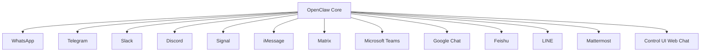
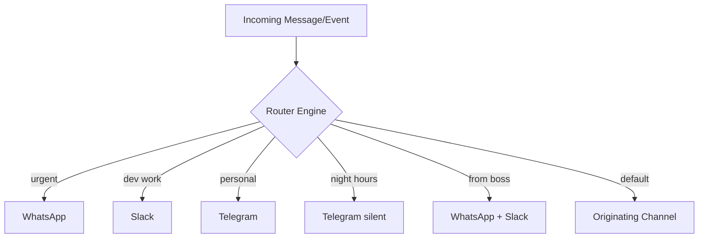

# Module 02: Channels

> **Level:** Beginner | **Time:** 45 minutes | **Prerequisites:** [Module 01 - Getting Started](../01-getting-started/)

Connect OpenClaw to 15+ messaging platforms and configure intelligent multi-channel routing.

---

## What You'll Learn

- How to connect each supported messaging platform
- Per-channel permission configuration
- Multi-channel routing rules
- Channel-specific best practices
- When to use which channel

---

## Supported Channels



| Channel | Setup Complexity | Best For | Rich Media | Group Support |
|---|---|---|---|---|
| **WhatsApp** | Medium (QR pairing) | Personal, on-the-go tasks | Images, docs | Yes |
| **Telegram** | Easy (bot token) | Power users, files, formatting | Full | Yes |
| **Slack** | Easy (bot token) | Workplace, team collaboration | Full | Yes |
| **Discord** | Easy (bot token) | Communities, personal servers | Full | Yes |
| **Signal** | Medium (linked device) | Privacy-focused communication | Limited | Yes |
| **iMessage** | Hard (macOS only) | Apple ecosystem users | Images | Yes |
| **Matrix** | Medium (homeserver) | Self-hosted, federated | Full | Yes |
| **Microsoft Teams** | Medium (app registration) | Enterprise workplace | Full | Yes |
| **Google Chat** | Medium (service account) | Google Workspace orgs | Limited | Yes |
| **Feishu** | Medium (app token) | Chinese enterprise teams | Full | Yes |
| **LINE** | Easy (channel token) | Asia-Pacific users | Stickers, images | Yes |
| **Mattermost** | Easy (webhook/bot) | Self-hosted Slack alternative | Full | Yes |

---

## Channel Setup

### WhatsApp

WhatsApp uses QR code pairing — OpenClaw runs as a linked device on your account.

```bash
openclaw channel pair whatsapp
```

A QR code appears in your terminal. Open WhatsApp > Settings > Linked Devices > Link a Device > Scan the QR code.

```yaml
# config.yaml
channels:
  whatsapp:
    enabled: true
    # No additional config needed — pairing handles everything
```

**WhatsApp Best Practices:**
- Ideal for quick, on-the-go interactions (reminders, summaries, queries)
- Send photos for OCR: snap a receipt, whiteboard, or document
- Forward emails to your OpenClaw WhatsApp chat for instant summarization
- Use voice messages — OpenClaw transcribes and responds
- Avoid long multi-step tasks (Telegram or Slack are better for those)

**Limitations:**
- No markdown formatting in responses
- Media handling is slower than Telegram
- Rate limits on message frequency

### Telegram

Telegram is the most feature-rich channel. Create a bot via [@BotFather](https://t.me/botfather):

1. Message @BotFather: `/newbot`
2. Choose a name and username
3. Copy the bot token

```yaml
# config.yaml
channels:
  telegram:
    enabled: true
    bot_token: ${TELEGRAM_BOT_TOKEN}
    parse_mode: "MarkdownV2"      # rich formatting
    allow_groups: true             # respond in group chats
    admin_only: true               # only respond to your messages (not random users)
    admin_chat_id: "123456789"     # your Telegram user ID
```

```bash
# Or use the CLI
openclaw channel pair telegram
```

**Telegram Best Practices:**
- Best channel for technical work — full markdown rendering
- Share code files directly for review
- Use inline `/` commands for quick actions
- Add to team groups for shared automation
- Use it as your primary "power user" channel

**Pro tip:** Create a private channel and add your bot. Use this as your personal command center — messages are searchable, editable, and pinnable.

### Slack

Add OpenClaw as a Slack app to your workspace:

```bash
openclaw channel pair slack
```

This opens a browser for OAuth authorization. Or configure manually:

```yaml
# config.yaml
channels:
  slack:
    enabled: true
    bot_token: ${SLACK_BOT_TOKEN}
    app_token: ${SLACK_APP_TOKEN}     # for Socket Mode (recommended)
    signing_secret: ${SLACK_SIGNING_SECRET}
```

**Slack Best Practices:**
- Channel-specific context: OpenClaw adjusts behavior based on which channel it's in
- Thread replies keep conversations organized
- Register custom slash commands: `/openclaw review PR #123`
- React-based triggers: add a specific emoji to a message to trigger an action
- Best for team-visible interactions (standups, reviews, status updates)

### Discord

Create a bot at [discord.com/developers](https://discord.com/developers/applications):

1. New Application > Bot > Copy Token
2. OAuth2 > URL Generator > Select `bot` scope + required permissions
3. Use generated URL to invite bot to your server

```yaml
# config.yaml
channels:
  discord:
    enabled: true
    bot_token: ${DISCORD_BOT_TOKEN}
    command_prefix: "!"              # or use slash commands
    allowed_guilds: ["your-server-id"]
    allowed_channels: ["general", "bot-commands"]
```

**Discord Best Practices:**
- Great for personal servers and small team communities
- Use dedicated bot channels to avoid noise
- Rich embed responses with links and formatting
- Voice channel awareness for meeting-like scenarios

### Signal

Signal uses the linked device protocol (similar to WhatsApp):

```bash
openclaw channel pair signal
```

```yaml
# config.yaml
channels:
  signal:
    enabled: true
    # Pairing handled automatically
```

**Signal Best Practices:**
- Best for privacy-sensitive communications
- No cloud storage of messages
- Use for personal/family automations
- Limited rich media compared to Telegram

### Other Channels

For iMessage, Matrix, Teams, Google Chat, Feishu, LINE, and Mattermost:

```bash
# List all channels with setup instructions
openclaw channel list --detailed

# Pair any channel
openclaw channel pair <channel-name>
```

---

## Multi-Channel Routing

The real power of OpenClaw's channel system: **intelligent message routing**.

### Basic Routing Rules

```yaml
# config.yaml
routing:
  rules:
    # Urgent messages go to WhatsApp (your phone)
    - match: "urgent|emergency|asap|critical"
      channels: [whatsapp]
      priority: high

    # Dev work stays in Slack
    - match: "pr|merge|deploy|build|pipeline|code"
      channels: [slack]

    # Personal stuff goes to Telegram
    - match: "personal|family|home|grocery|dinner"
      channels: [telegram]

    # Everything else goes to the originating channel
    - match: "*"
      channels: [origin]
```

### Advanced Routing

```yaml
routing:
  rules:
    # Time-based routing
    - match: "*"
      condition: "time.hour >= 22 || time.hour <= 7"
      channels: [telegram]          # night messages → quiet channel
      suppress_notification: true   # no buzz

    # Sender-based routing
    - match: "*"
      condition: "sender.is_manager"
      channels: [whatsapp, slack]   # boss messages → both channels

    # Content-type routing
    - match: "*"
      condition: "content.has_image"
      channels: [telegram]          # images → best media handling

    # Integration-based routing
    - match: "*"
      source: "github"
      channels: [slack]             # GitHub events → Slack

    - match: "*"
      source: "gmail"
      condition: "email.from contains 'boss@company.com'"
      channels: [whatsapp]          # boss emails → phone
```

### Routing Architecture



---

## Per-Channel Permissions

Not every channel deserves equal trust. A compromised WhatsApp session shouldn't be able to run shell commands.

```yaml
channels:
  whatsapp:
    enabled: true
    permissions:
      can_execute_shell: false           # no shell from WhatsApp
      can_access_filesystem: read        # read-only
      can_modify_config: false           # can't change settings
      can_send_to_other_channels: false  # no cross-channel sends
      max_tokens_per_message: 4096       # limit response length

  telegram:
    enabled: true
    permissions:
      can_execute_shell: true            # trusted channel
      can_access_filesystem: readwrite
      can_modify_config: false
      can_send_to_other_channels: true
      max_tokens_per_message: 16384

  slack:
    enabled: true
    permissions:
      can_execute_shell: true            # work environment
      can_access_filesystem: readwrite
      can_modify_config: true            # admins can configure
      can_send_to_other_channels: true
      max_tokens_per_message: 16384
```

### Permission Levels

| Level | Shell | Filesystem | Config | Cross-Channel |
|---|---|---|---|---|
| **Locked** | No | No | No | No |
| **Restricted** | No | Read-only | No | No |
| **Standard** | Sandboxed | Read-Write (scoped) | No | Yes |
| **Trusted** | Full | Read-Write | No | Yes |
| **Admin** | Full | Read-Write | Yes | Yes |
| **Custom** | Configurable | Configurable | Configurable | Configurable |

---

## Channel Commands

```bash
# List all channels and their status
openclaw channel list

# Show detailed status for a channel
openclaw channel status telegram

# Pair/connect a new channel
openclaw channel pair <name>

# Test a channel connection
openclaw channel test <name>

# Disconnect a channel
openclaw channel disconnect <name>

# View channel-specific logs
openclaw channel logs <name> --tail 50
```

---

## Decision Matrix: Which Channel for What?

| Task | Best Channel | Why |
|---|---|---|
| Quick reminders | WhatsApp | Always on your phone |
| Code review requests | Slack | Team visibility, threads |
| Technical conversations | Telegram | Best formatting, file sharing |
| Personal automations | Telegram | Feature-rich, private |
| Team status updates | Slack | Workspace integration |
| Urgent notifications | WhatsApp | Push notifications, always seen |
| Community bots | Discord | Server infrastructure |
| Privacy-sensitive tasks | Signal | E2E encrypted, no cloud |
| Enterprise workflows | Teams | Office 365 integration |
| Long research outputs | Control UI | Best rendering, no limits |

---

## Key Takeaways

- Start with 1-2 channels, expand as you find your workflow
- Telegram is the most capable channel for power users
- Slack is best for workplace team interactions
- WhatsApp is best for urgent, on-the-go messages
- Use multi-channel routing to automatically direct information
- Set per-channel permissions — don't trust all channels equally
- The right channel for the right task is the key insight

---

## What's Next

1. **[Module 03 - Memory](../03-memory/)** — Teach OpenClaw your preferences so responses feel personal across all channels
2. **[Module 04 - Skills](../04-skills/)** — Trigger skills from different channels for context-aware automation
3. **[Module 06 - Automation](../06-automation/)** — Route automated outputs to the right channel with multi-channel cron jobs

Once your channels are stable, see **[OPERATIONS.md](../OPERATIONS.md)** for ongoing channel health checks and **[POWER_USER_PLAYBOOK.md](../POWER_USER_PLAYBOOK.md)** for multi-channel routing patterns. For a quick command cheat sheet, see **[QUICK_REFERENCE.md](../QUICK_REFERENCE.md)**. For the full command reference, see **[CATALOG.md](../CATALOG.md)**. For a guided path through all modules, see **[LEARNING-ROADMAP.md](../LEARNING-ROADMAP.md)**.

Having channel issues? See the [Troubleshooting Guide](../TROUBLESHOOTING.md) for channel-specific diagnostics.
