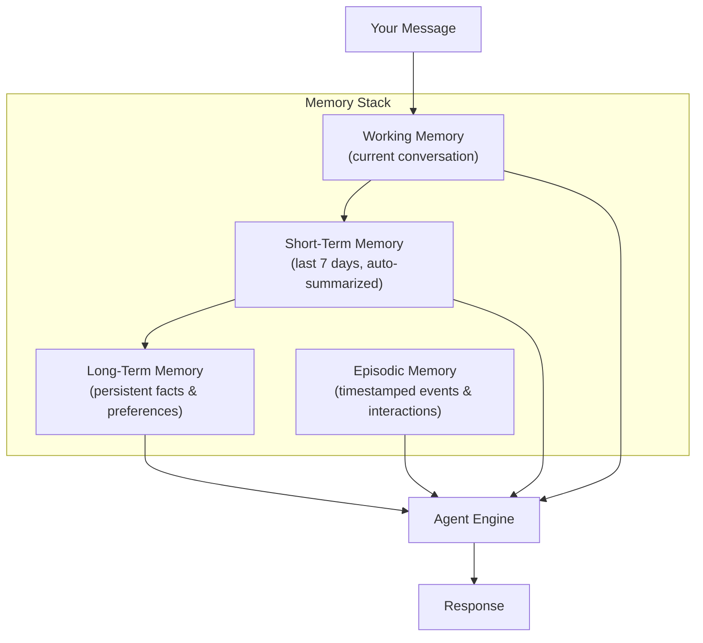
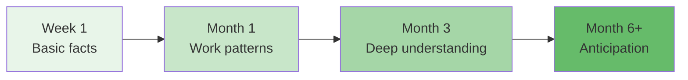

# Module 03: Memory & Context

> **Level:** Beginner | **Time:** 45 minutes | **Prerequisites:** [Module 01 - Getting Started](../01-getting-started/)

Understand OpenClaw's persistent memory system and learn how to teach it about yourself for increasingly personalized and accurate responses.

---

## What You'll Learn

- How the memory stack works (working, short-term, long-term, episodic)
- How to teach OpenClaw about yourself, your role, and your preferences
- Memory commands for storing, recalling, and pruning
- Best practices for memory hygiene
- The compound effect of good context

---

## Why Memory Matters

A stateless chatbot answers the same question the same way every time, regardless of who you are. OpenClaw's persistent memory means:

- It knows you're a backend engineer, so it explains things in terms of systems, not UIs
- It knows your manager is Sarah, so emails from sarah@company.com get flagged as high priority
- It knows your sprints end on Fridays, so it auto-generates sprint summaries on Thursday evening
- It knows you hate morning meetings, so it never suggests slots before 10 AM

**The more context OpenClaw has, the less you have to explain.** This compounds over time.

---

## Memory Architecture



| Layer | What It Stores | Lifespan | Size Limit |
|---|---|---|---|
| **Working Memory** | Current conversation context | Session | `max_tokens` config |
| **Short-Term Memory** | Recent interactions, auto-summarized | 7 days (configurable) | Auto-pruned |
| **Long-Term Memory** | Facts, preferences, patterns | Permanent | Manual pruning |
| **Episodic Memory** | Timestamped events and interactions | Permanent | Auto-archived |

---

## Teaching OpenClaw About You

### The Initial Context Dump

Spend 10-15 minutes in your first session providing context. This is the highest-ROI time you'll spend with OpenClaw:

```
You: "Let me tell you about myself so you can help me better.

     I'm Nhat, a senior software engineer at Acme Corp. I work on the
     payments team. We use Python, Go, and TypeScript. Our stack is
     PostgreSQL, Redis, Kafka, and Kubernetes on AWS.

     My manager is Sarah Chen. Our team has 6 engineers. We do 2-week
     sprints ending on Fridays. Standups are at 10 AM daily on Zoom.

     I'm in the Asia/Ho_Chi_Minh timezone (UTC+7). I prefer terse
     communication — no fluff or pleasantries. When I ask for code,
     give me production-ready code with error handling.

     I use VS Code, iTerm2, and Arc browser. My GitHub username is
     dinhnhat0401. I use Todoist for task management and Obsidian
     for notes."
```

OpenClaw stores all of this in long-term memory and uses it for every future interaction.

### Progressive Teaching

You don't need to dump everything at once. Teach naturally as you work:

```
You: "Remember that our deploy pipeline takes ~15 minutes"

You: "Remember that the payment-service repo requires Go 1.22+"

You: "Remember that I prefer pytest over unittest"

You: "Remember that our API uses snake_case for all field names"
```

### Correcting Mistakes

If OpenClaw gets something wrong, correct it immediately:

```
You: "No, our standups are at 10 AM, not 9 AM. Update your memory."

You: "Stop using TypeScript for code examples — I always want Python."

You: "When I say 'deploy', I mean push to staging, not production."
```

Corrections are stored with high priority and override previous assumptions.

---

## Memory Commands

### Storing Memories

```
"Remember that [fact]"
"Save this: [information]"
"Note for future: [context]"
"Keep in mind that [preference]"
```

### Recalling Memories

```
"What do you know about me?"
"What do you remember about project Phoenix?"
"What are my preferences for code style?"
"Tell me everything you know about my team."
```

### Updating Memories

```
"Update: Sarah is no longer my manager, it's now James."
"Change my preferred timezone to US/Pacific — I moved."
"Correct your memory: our sprint is now 1 week, not 2."
```

### Pruning Memories

```
"Forget everything about project Phoenix — it's done."
"Clear all memories about the old auth system."
"Prune outdated memories — what do you have that's stale?"
```

### CLI Memory Commands

```bash
# View memory statistics
openclaw memory stats

# Search memory
openclaw memory search "project Phoenix"

# Export for backup
openclaw memory export > ~/memory-backup.json

# Import from backup
openclaw memory import < ~/memory-backup.json

# Prune entries older than 90 days
openclaw memory prune --older-than 90d

# Reset all memory (destructive!)
openclaw memory reset
```

---

## Memory Configuration

```yaml
# config.yaml
memory:
  backend: local                    # local | redis | postgres
  persist_path: ~/.openclaw/memory
  auto_summarize: true              # compress old short-term memory
  auto_summarize_after: 7d          # when to summarize
  max_context_tokens: 100000        # how much memory to load per interaction
  episodic:
    enabled: true
    retention: 365d                 # keep episodic memory for 1 year
  long_term:
    max_entries: 10000
  short_term:
    retention: 7d
    summarize_threshold: 50         # summarize after 50 entries
```

### Backend Options

| Backend | Best For | Setup |
|---|---|---|
| **local** | Single machine, personal use | Default, no setup needed |
| **redis** | Multi-instance, fast access | Requires Redis server |
| **postgres** | Large memory, advanced queries | Requires PostgreSQL |

---

## Memory Categories

OpenClaw organizes memories into categories for efficient retrieval:

### Identity & Role

```
"I'm a senior backend engineer"
"I work at Acme Corp on the payments team"
"My GitHub username is dinhnhat0401"
```

### Preferences

```
"I prefer Python over JavaScript"
"Always use dark mode in screenshots"
"I like bullet points over paragraphs"
"Give me terse responses — no fluff"
```

### Technical Context

```
"Our API uses REST, not GraphQL"
"We use PostgreSQL 16 in production"
"Deploy pipeline takes ~15 minutes"
"CI runs on GitHub Actions"
```

### People & Relationships

```
"My manager is Sarah Chen"
"Alex on the frontend team is the React expert"
"Contact legal@acme.com for compliance questions"
```

### Projects & Timelines

```
"Project Phoenix deadline is April 15, 2026"
"We're in sprint 24, ending this Friday"
"Code freeze for v2.0 starts March 1"
```

### Patterns & Shortcuts

```
"When I say 'ship it', run tests, build, and push to staging"
"When I say 'standup', generate my daily report"
"When I say 'triage', check Gmail and categorize emails"
```

---

## Best Practices

### Do

- **Front-load context** — the initial 15-minute investment pays dividends forever
- **Correct mistakes immediately** — wrong memories compound into wrong assumptions
- **Be specific** — "I prefer pytest with fixtures" is better than "I like testing"
- **Use patterns/shortcuts** — define custom trigger words for common workflows
- **Audit monthly** — ask "What do you remember about me?" and clean up stale entries

### Don't

- **Don't store secrets** — no passwords, API keys, or tokens in memory
- **Don't over-specify** — OpenClaw doesn't need to know your favorite color (unless it's relevant)
- **Don't forget to prune** — outdated memories cause confusion and wrong decisions
- **Don't duplicate** — if something is in your config, it doesn't also need to be in memory

---

## The Compound Effect



| Timeframe | Memory State | Interaction Quality |
|---|---|---|
| **Week 1** | Name, role, basic preferences | Generic but useful |
| **Month 1** | Work patterns, tools, team, projects | Personalized and efficient |
| **Month 3** | Deep context on codebase, relationships, history | Anticipates needs |
| **Month 6+** | Full model of your work life | Proactive, feels like a colleague |

The difference between a Month 1 OpenClaw and a Month 6 OpenClaw is like the difference between a new hire and a trusted colleague. Invest in teaching it early.

---

## Advanced: Memory-Driven Automation

Combine memory with automation for powerful workflows:

```
"Remember: every Monday at 9 AM, check if any PRs from last
 week are still open and ping the authors on Slack."

"Remember: when I receive an email from a @bigclient.com domain,
 immediately summarize it and send to my WhatsApp."

"Remember: before any meeting with the VP, pull the latest
 metrics from our dashboard and prepare talking points."
```

These become persistent behaviors that OpenClaw executes automatically.

---

## Key Takeaways

- Memory is OpenClaw's superpower — it's what makes it feel like a colleague, not a chatbot
- Invest 15 minutes upfront teaching it about yourself
- Correct mistakes immediately — they compound
- Audit and prune monthly
- Define custom shortcuts ("ship it", "standup", "triage") for common workflows
- The longer you use OpenClaw, the better it gets — this is the compound effect
