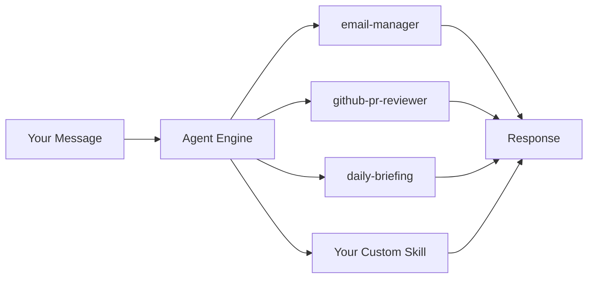
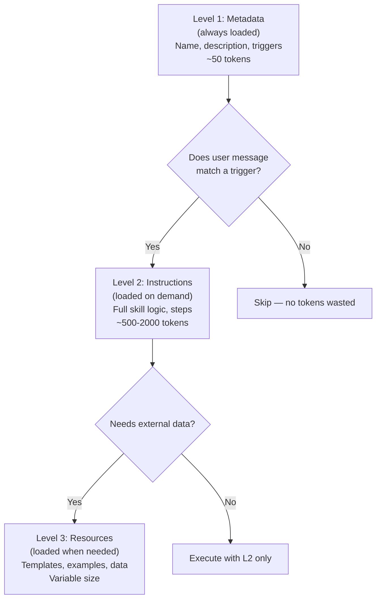
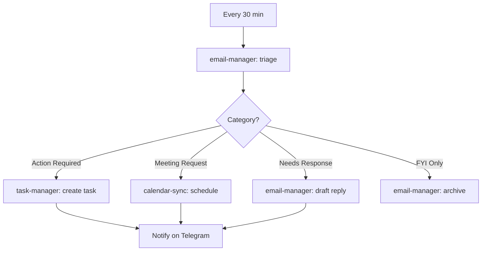

# Module 04: Skills

> **Level:** Intermediate | **Time:** 1.5 hours | **Prerequisites:** [Module 01](../01-getting-started/), [Module 03](../03-memory/)

Master OpenClaw's modular skill system — install community skills, create your own, and chain them into powerful automation pipelines.

---

## What You'll Learn

- How the skill system works
- Installing and managing community skills
- Creating custom skills with `skill.yaml`
- Three-level loading architecture
- Skill chaining and pipelines
- Sharing skills with the community

---

## What Are Skills?

Skills are **modular, reusable capabilities** that extend OpenClaw. Think of them as plugins with a defined interface:



Each skill:
- Has a defined purpose and scope
- Can access specific tools (shell, browser, integrations)
- Can be triggered manually or automatically
- Can invoke other skills (chaining)

---

## Installing Community Skills

### Browsing the Registry

```bash
# Search by keyword
openclaw skill search "email"
openclaw skill search "github"
openclaw skill search "productivity"

# Browse categories
openclaw skill browse --category developer
openclaw skill browse --category productivity
openclaw skill browse --category communication
openclaw skill browse --category automation

# View skill details before installing
openclaw skill info email-manager
```

### Installing Skills

```bash
# From the community registry
openclaw skill install email-manager
openclaw skill install github-pr-reviewer
openclaw skill install meeting-summarizer
openclaw skill install daily-briefing
openclaw skill install expense-tracker
openclaw skill install standup-reporter
openclaw skill install inbox-zero
openclaw skill install research-agent

# From a Git repository
openclaw skill install https://github.com/user/custom-skill.git

# From a local directory
openclaw skill install ./my-local-skill/

# Specific version
openclaw skill install email-manager@2.1.0
```

### Managing Skills

```bash
# List installed skills
openclaw skill list

# Enable/disable
openclaw skill enable email-manager
openclaw skill disable expense-tracker

# Update
openclaw skill update email-manager
openclaw skill update --all

# Remove
openclaw skill remove expense-tracker

# View skill configuration
openclaw skill config email-manager
```

---

## Essential Skills Catalog

### Productivity

| Skill | Description | Triggers |
|---|---|---|
| `daily-briefing` | Morning summary of calendar, email, tasks, weather | Cron (7:30 AM) or "briefing" |
| `inbox-zero` | Auto-categorize and draft email responses | Cron (every 30 min) or "triage" |
| `meeting-summarizer` | Notes, action items, follow-up drafts | Auto on meeting end |
| `expense-tracker` | OCR receipts, categorize, generate reports | Image upload or "expense" |
| `research-agent` | Deep web research with source citations | "research [topic]" |
| `note-taker` | Capture and organize notes across tools | "note [content]" |

### Developer

| Skill | Description | Triggers |
|---|---|---|
| `github-pr-reviewer` | Automated code review with suggestions | GitHub webhook or "review PR" |
| `standup-reporter` | Generate daily standups from git history | Cron (9 AM) or "standup" |
| `ci-monitor` | Watch CI/CD pipelines, report failures | GitHub Actions webhook |
| `dependency-checker` | Scan for outdated or vulnerable deps | Cron (weekly) or "check deps" |
| `release-notes` | Auto-generate release notes from commits | "release notes for v1.2.3" |

### Communication

| Skill | Description | Triggers |
|---|---|---|
| `email-manager` | Full email lifecycle management | "email [action]" |
| `calendar-sync` | Cross-platform calendar management | "calendar" or event triggers |
| `task-manager` | Sync tasks across Todoist/Things/Trello | "task [action]" |
| `follow-up-tracker` | Track and remind on pending follow-ups | Cron (daily) |

---

## Three-Level Loading

Skills use a progressive loading system to minimize token usage:



This means:
- **Level 1** is always in context — negligible cost
- **Level 2** loads only when the skill is invoked
- **Level 3** loads only when the skill needs reference material

**Why this matters:** You can have 100 skills installed without bloating your context window. Only active skills consume tokens.

---

## Creating Custom Skills

### Directory Structure

```
~/.openclaw/skills/
└── my-skill/
    ├── skill.yaml          # Required: metadata, triggers, steps
    ├── templates/           # Optional: prompt templates
    │   └── report.md
    ├── resources/           # Optional: reference data
    │   └── categories.json
    └── README.md            # Optional: documentation
```

### skill.yaml — Full Reference

```yaml
# ── Metadata (Level 1 — always loaded) ──
name: standup-reporter
description: Generate daily standup reports from git activity and calendar
version: 1.0.0
author: your-name
tags: [developer, productivity, automation]

# ── Triggers ──
triggers:
  # Automatic (cron)
  - type: cron
    schedule: "0 9 * * 1-5"          # Weekdays at 9 AM

  # Manual (keyword in message)
  - type: keyword
    match: "standup|stand-up|daily report"

  # Event-driven
  - type: webhook
    source: github
    event: push

# ── Configuration (user-overridable) ──
config:
  repo_path: "~/Projects/main-repo"
  team_channel: "#team-standup"
  include_calendar: true
  lookback_hours: 24

# ── Steps (Level 2 — loaded on trigger) ──
steps:
  - name: get_commits
    tool: shell
    command: |
      cd {{ config.repo_path }}
      git log --oneline --since="{{ config.lookback_hours }} hours ago" \
        --author="$(git config user.email)"

  - name: get_calendar
    tool: calendar
    action: list
    range: today
    filter: meetings
    condition: "{{ config.include_calendar }}"

  - name: get_open_prs
    tool: github
    action: list_prs
    state: open
    author: "@me"

  - name: generate_report
    tool: llm
    prompt: |
      Generate a concise daily standup report.

      Yesterday's commits:
      {{ get_commits.output }}

      Today's meetings:
      {{ get_calendar.output }}

      Open PRs:
      {{ get_open_prs.output }}

      Format as:
      **Yesterday:** [bullet points of what was done]
      **Today:** [bullet points of planned work, based on meetings and open PRs]
      **Blockers:** [any blockers, or "None"]

  - name: send_report
    tool: channel
    target: slack
    channel: "{{ config.team_channel }}"
    message: "{{ generate_report.output }}"

  - name: notify_me
    tool: channel
    target: telegram
    message: "Standup posted to {{ config.team_channel }}"
```

### Template Variables

| Variable | Description |
|---|---|
| `{{ config.* }}` | User configuration values |
| `{{ step_name.output }}` | Output from a previous step |
| `{{ trigger.message }}` | The message that triggered the skill |
| `{{ trigger.source }}` | Which channel triggered it |
| `{{ user.name }}` | User's name from memory |
| `{{ user.timezone }}` | User's timezone |
| `{{ datetime.now }}` | Current datetime |
| `{{ datetime.today }}` | Today's date |

---

## Skill Chaining

Skills can invoke other skills, creating powerful pipelines:

### Example: Email-to-Action Pipeline

```yaml
name: email-to-action
description: Process incoming emails into actionable tasks
triggers:
  - type: cron
    schedule: "*/30 * * * *"        # Every 30 minutes

steps:
  - name: triage
    skill: email-manager
    action: triage
    # Returns categorized emails

  - name: create_tasks
    tool: llm
    prompt: |
      From these triaged emails:
      {{ triage.output }}

      For each email marked "action_required":
      1. Extract the action item
      2. Estimate urgency (high/medium/low)
      3. Suggest a due date

  - name: add_to_todoist
    skill: task-manager
    action: create_batch
    tasks: "{{ create_tasks.output }}"

  - name: schedule_meetings
    skill: calendar-sync
    action: auto_schedule
    condition: "{{ triage.output contains 'meeting_request' }}"
    input: "{{ triage.meeting_requests }}"

  - name: draft_replies
    skill: email-manager
    action: draft_replies
    input: "{{ triage.needs_response }}"
```

### Pipeline Visualization



---

## Scope Hierarchy

Skills can be defined at three levels:

```
Organization Skills  (shared across all users in an org)
    └── Personal Skills  (your ~/.openclaw/skills/)
        └── Project Skills  (.openclaw/skills/ in a project directory)
```

| Scope | Location | Overrides |
|---|---|---|
| **Organization** | Configured by org admin | Lowest priority |
| **Personal** | `~/.openclaw/skills/` | Overrides org |
| **Project** | `.openclaw/skills/` in repo | Highest priority |

A project-level skill with the same name as a personal skill takes precedence when you're working in that project directory.

---

## Skill Configuration

Users can override skill defaults without editing the skill itself:

```yaml
# ~/.openclaw/config.yaml
skills:
  standup-reporter:
    config:
      repo_path: "~/Projects/payments-api"
      team_channel: "#payments-team"
      include_calendar: false
      lookback_hours: 48

  email-manager:
    config:
      provider: gmail
      check_interval: "15m"
      auto_archive_newsletters: true
      draft_tone: "professional"
```

---

## Testing Skills

```bash
# Dry run — shows what would happen without executing
openclaw skill test standup-reporter --dry-run

# Run with verbose output
openclaw skill run standup-reporter --verbose

# Run with overridden config
openclaw skill run standup-reporter --set repo_path=~/Projects/other-repo

# View execution history
openclaw skill history standup-reporter --last 10
```

---

## Sharing Skills

### Publishing to the Registry

```bash
# Validate your skill
openclaw skill validate ./my-skill/

# Publish
openclaw skill publish ./my-skill/
```

### Publishing to GitHub

```bash
cd ~/.openclaw/skills/my-skill
git init
git add .
git commit -m "Initial release"
gh repo create my-openclaw-skill --public --push
```

Others can install it with:

```bash
openclaw skill install https://github.com/you/my-openclaw-skill.git
```

---

## Best Practices

### Do

- **Keep skills focused** — one skill, one job. Chain them for complex workflows.
- **Use configuration** — make skills configurable so users can adapt without editing
- **Handle errors** — include fallback steps for when APIs fail
- **Document triggers** — make it clear what activates the skill
- **Version your skills** — use semantic versioning

### Don't

- **Don't hardcode secrets** — use `${ENV_VAR}` references
- **Don't make mega-skills** — if a skill has 20+ steps, split it
- **Don't ignore the three-level system** — put metadata in L1, logic in L2, data in L3
- **Don't skip testing** — always `--dry-run` before deploying to cron

---

## Key Takeaways

- Skills are modular capabilities that extend OpenClaw's functionality
- The three-level loading system keeps token usage efficient even with many skills
- Community registry has skills for email, GitHub, calendar, tasks, and more
- Custom skills are defined in `skill.yaml` with triggers, config, and steps
- Skill chaining lets you build autonomous pipelines (email → tasks → calendar → replies)
- Scope hierarchy lets you override skills per-project

---

## What's Next

1. **[Module 05 - Integrations](../05-integrations/)** — Connect skills to external services for real-world actions
2. **[Module 08 - Workflows](../08-workflows/)** — Chain multiple skills into autonomous multi-step pipelines
3. **[Module 06 - Automation](../06-automation/)** — Schedule skills to run on cron or fire on events

For skill chaining recipes and productivity patterns, see **[POWER_USER_PLAYBOOK.md](../POWER_USER_PLAYBOOK.md)**. For routine skill audits and cleanup, see **[OPERATIONS.md](../OPERATIONS.md)**.

Skills misbehaving? See the [Troubleshooting Guide](../TROUBLESHOOTING.md) for debugging strategies.
