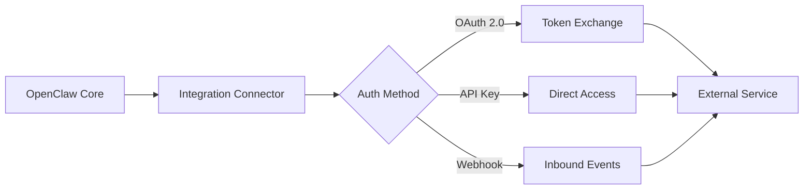
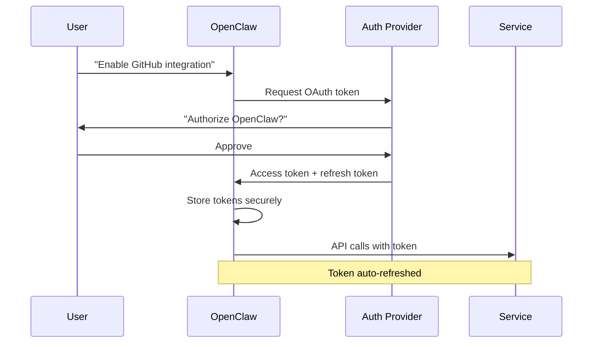
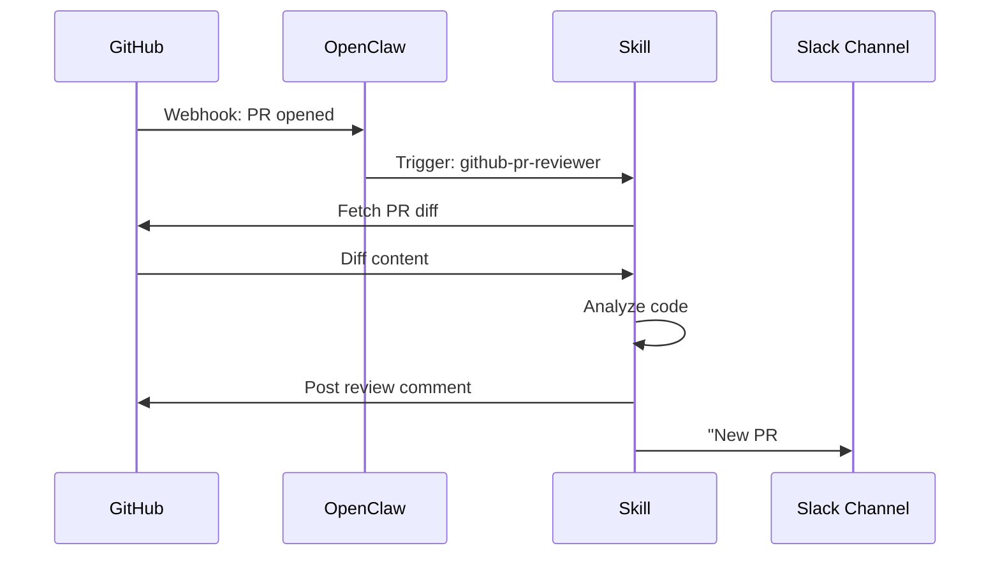

# Module 05: Integrations

> **Level:** Intermediate | **Time:** 1 hour | **Prerequisites:** [Module 01](../01-getting-started/), [Module 04](../04-skills/)

Connect OpenClaw to 50+ external services — from Gmail and GitHub to Spotify and smart home devices.

---

## What You'll Learn

- How integrations work under the hood
- Setting up integrations for each service category
- Authentication methods (OAuth, API key, token)
- Integration-specific best practices
- Combining integrations with skills and automations

---

## How Integrations Work



Each integration is a **bidirectional connector**:
- **Outbound:** OpenClaw calls the service's API (read emails, create tasks, etc.)
- **Inbound:** The service notifies OpenClaw of events (new PR, new email, etc.)

---

## Managing Integrations

```bash
# List all available integrations
openclaw integration list

# List only enabled integrations
openclaw integration list --enabled

# View details for a specific integration
openclaw integration info github

# Enable an integration
openclaw integration enable github

# Configure an integration
openclaw integration config github

# Test connectivity
openclaw integration test github

# Disable an integration
openclaw integration disable github
```

---

## Productivity & Notes

### Gmail

```bash
openclaw integration enable gmail
```

**Auth:** OAuth 2.0 or App Password

```yaml
# config.yaml
integrations:
  gmail:
    enabled: true
    auth: oauth                    # oauth | app_password
    account: you@gmail.com
    scopes:
      - read
      - send
      - modify                     # label, archive, etc.
    check_interval: "5m"           # poll for new emails
```

**Capabilities:**
| Action | Example |
|---|---|
| Read emails | "Show my unread emails from today" |
| Send emails | "Send an email to bob@company.com about the Q3 report" |
| Draft emails | "Draft a follow-up to the legal team" |
| Label/archive | "Archive all newsletters" |
| Search | "Find emails from Sarah about the budget" |
| Batch operations | "Mark all promotional emails as read" |

### Google Calendar / Apple Calendar

```yaml
integrations:
  calendar:
    enabled: true
    providers:
      - type: google
        account: you@gmail.com
      - type: apple
        # Uses system calendar on macOS
    default_duration: 30m          # default event length
    working_hours:
      start: "09:00"
      end: "18:00"
    buffer_between_meetings: 15m   # prevent back-to-back
```

**Capabilities:**
| Action | Example |
|---|---|
| View schedule | "What's on my calendar today?" |
| Create events | "Schedule a 1:1 with Sarah tomorrow at 2pm" |
| Find free slots | "When am I free this week for a 1-hour meeting?" |
| RSVP | "Accept the team offsite invitation" |
| Smart scheduling | "Find a time that works for me and Alex this week" |

### Obsidian

```yaml
integrations:
  obsidian:
    enabled: true
    vault_path: "~/Documents/ObsidianVault"
    daily_notes: true
    daily_notes_folder: "Daily"
    templates_folder: "Templates"
```

**Capabilities:**
| Action | Example |
|---|---|
| Create notes | "Create a meeting note for today's standup" |
| Search vault | "Find my notes about microservices architecture" |
| Append to notes | "Add this to my project Phoenix notes" |
| Link notes | "Link today's daily note to the Q3 planning page" |
| Tag management | "Show all notes tagged #urgent" |

### Notion

```yaml
integrations:
  notion:
    enabled: true
    token: ${NOTION_TOKEN}
    default_database: "Tasks"
```

### Todoist

```yaml
integrations:
  todoist:
    enabled: true
    token: ${TODOIST_TOKEN}
    default_project: "Inbox"
    sync_interval: "5m"
```

### Things 3 (macOS)

```yaml
integrations:
  things3:
    enabled: true
    # Uses URL scheme on macOS — no token needed
```

### Trello

```yaml
integrations:
  trello:
    enabled: true
    api_key: ${TRELLO_API_KEY}
    token: ${TRELLO_TOKEN}
    default_board: "Work"
```

### Apple Reminders (macOS)

```yaml
integrations:
  apple_reminders:
    enabled: true
    default_list: "Reminders"
```

---

## Developer Tools

### GitHub

```bash
openclaw integration enable github
```

```yaml
integrations:
  github:
    enabled: true
    token: ${GITHUB_TOKEN}
    default_org: "acme-corp"
    watched_repos:
      - "acme-corp/payments-api"
      - "acme-corp/frontend"
    webhooks:
      - event: pull_request
        action: [opened, synchronize]
      - event: issues
        action: [opened, labeled]
      - event: workflow_run
        action: [completed]
```

**Capabilities:**
| Action | Example |
|---|---|
| PR management | "Create a PR from feature/auth to main" |
| Code review | "Review the latest PR on payments-api" |
| Issue tracking | "Create an issue: login page 500 error on mobile" |
| CI/CD monitoring | "What's the status of the latest CI run?" |
| Release management | "Create a release v2.1.0 with notes from the last 20 commits" |
| Code search | "Find all usages of deprecated `oldAuth()` across our repos" |

### Jira

```yaml
integrations:
  jira:
    enabled: true
    url: "https://acme.atlassian.net"
    email: you@acme.com
    token: ${JIRA_TOKEN}
    default_project: "PAY"
```

### Linear

```yaml
integrations:
  linear:
    enabled: true
    token: ${LINEAR_TOKEN}
    default_team: "Engineering"
```

### Vercel

```yaml
integrations:
  vercel:
    enabled: true
    token: ${VERCEL_TOKEN}
    default_project: "frontend"
```

---

## Communication

### Zoom

```yaml
integrations:
  zoom:
    enabled: true
    client_id: ${ZOOM_CLIENT_ID}
    client_secret: ${ZOOM_CLIENT_SECRET}
    # OAuth handled automatically
```

**Capabilities:** Schedule meetings, get meeting transcripts, join for note-taking.

### Microsoft Outlook / Office 365

```yaml
integrations:
  outlook:
    enabled: true
    tenant_id: ${AZURE_TENANT_ID}
    client_id: ${AZURE_CLIENT_ID}
    client_secret: ${AZURE_CLIENT_SECRET}
```

---

## Smart Home & IoT

### Philips Hue

```yaml
integrations:
  hue:
    enabled: true
    bridge_ip: "192.168.1.100"
    username: ${HUE_USERNAME}        # generated during pairing
```

**Capabilities:**
```
"Turn off the office lights"
"Set the living room to warm white at 50%"
"Activate the 'movie night' scene"
```

### Home Assistant

```yaml
integrations:
  home_assistant:
    enabled: true
    url: "http://homeassistant.local:8123"
    token: ${HA_TOKEN}
```

**Capabilities:** Control any device connected to Home Assistant — lights, thermostats, locks, cameras, sensors.

### Apple HomeKit (macOS)

```yaml
integrations:
  homekit:
    enabled: true
    # Uses system HomeKit on macOS
```

---

## Media & Personal

### Spotify

```yaml
integrations:
  spotify:
    enabled: true
    client_id: ${SPOTIFY_CLIENT_ID}
    client_secret: ${SPOTIFY_CLIENT_SECRET}
```

**Capabilities:**
```
"Play my Discover Weekly playlist"
"What's currently playing?"
"Add this song to my 'Focus' playlist"
"Play something chill for coding"
```

### Apple Music (macOS)

```yaml
integrations:
  apple_music:
    enabled: true
    # Uses system Music app on macOS
```

### Apple Health (macOS/iOS)

```yaml
integrations:
  apple_health:
    enabled: true
    metrics: [steps, heart_rate, sleep, workouts]
    read_only: true                  # never write health data
```

**Capabilities:**
```
"How many steps did I take this week?"
"What was my average heart rate during yesterday's run?"
"Show my sleep pattern for the last month"
```

---

## Finance

### Plaid (Banking)

```yaml
integrations:
  plaid:
    enabled: true
    client_id: ${PLAID_CLIENT_ID}
    secret: ${PLAID_SECRET}
    environment: production        # sandbox | development | production
```

### Stripe

```yaml
integrations:
  stripe:
    enabled: true
    secret_key: ${STRIPE_SECRET_KEY}
    read_only: true                # safety — no accidental charges
```

---

## Integration Architecture

### Authentication Flow



### Event Flow (Webhooks)



---

## Integration Best Practices

### Security

| Practice | Why |
|---|---|
| Use OAuth over API keys when available | Tokens can be scoped and revoked |
| Enable `read_only` for finance integrations | Prevent accidental transactions |
| Rotate tokens quarterly | Limit exposure window |
| Use separate tokens per integration | Revoke one without affecting others |
| Never store tokens in config.yaml | Always use `${ENV_VAR}` references |

### Performance

| Practice | Why |
|---|---|
| Set reasonable `check_interval` | Don't burn API rate limits polling every second |
| Use webhooks over polling when available | Real-time + less API usage |
| Enable caching for read-heavy integrations | Reduce latency and API calls |
| Disable unused integrations | Every enabled integration consumes resources |

### Reliability

| Practice | Why |
|---|---|
| Test each integration after setup | Catch auth issues early |
| Monitor integration health | `openclaw integration status --all` |
| Set up fallback behavior | What happens when Gmail is down? |
| Keep integration versions updated | `openclaw integration update --all` |

---

## Key Takeaways

- 50+ integrations cover productivity, dev tools, communication, smart home, media, and finance
- Each integration is bidirectional — OpenClaw can read from and act on services
- OAuth is preferred over API keys for security
- Combine integrations with skills for powerful automation pipelines
- Use `read_only` mode for sensitive integrations (finance, health)
- Test and monitor integration health regularly

---

## What's Next

1. **[Module 06 - Automation](../06-automation/)** — Trigger automations when integrations receive new data
2. **[Module 08 - Workflows](../08-workflows/)** — Combine integrations into end-to-end autonomous pipelines
3. **[Module 09 - Advanced Features](../09-advanced-features/)** — Security hardening and permission scoping for sensitive integrations

For integration health monitoring routines, see **[OPERATIONS.md](../OPERATIONS.md)**. For production integration patterns, see **[POWER_USER_PLAYBOOK.md](../POWER_USER_PLAYBOOK.md)**. For a full command reference, see **[CATALOG.md](../CATALOG.md)**. For a guided path through all modules, see **[LEARNING-ROADMAP.md](../LEARNING-ROADMAP.md)**.

Auth expired or integration broken? See the [Troubleshooting Guide](../TROUBLESHOOTING.md#9-integration-auth-expired) for diagnosis steps.
