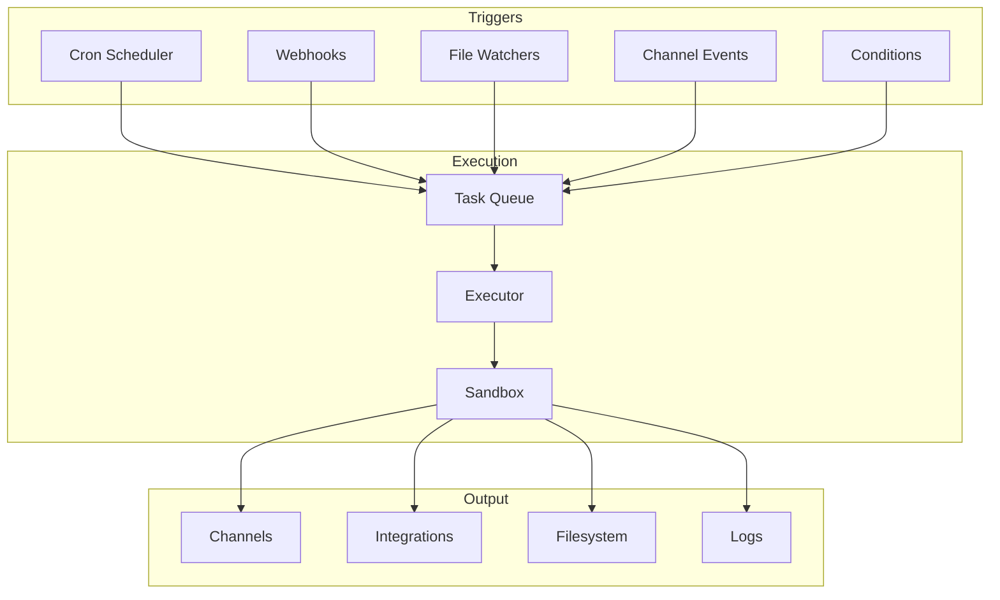

# Module 06: Automation & Scheduling

> **Level:** Intermediate | **Time:** 1.5 hours | **Prerequisites:** [Module 04](../04-skills/), [Module 05](../05-integrations/)

Build a 24/7 productivity machine with cron jobs, event triggers, background tasks, and proactive automations.

---

## What You'll Learn

- How OpenClaw's scheduling system works
- Creating cron jobs for recurring tasks
- Event-driven triggers (webhooks, file watchers, conditions)
- Background tasks and long-running operations
- Production-ready automation templates

---

## Automation Architecture



---

## Cron Jobs

### Creating Cron Jobs

```bash
# Interactive creation
openclaw cron create

# From a YAML definition
openclaw cron create --file morning-briefing.yaml

# Quick one-liner
openclaw cron create --schedule "30 7 * * *" --action "Send me a morning briefing"
```

### Cron Schedule Syntax

```
┌───────────── minute (0-59)
│ ┌───────────── hour (0-23)
│ │ ┌───────────── day of month (1-31)
│ │ │ ┌───────────── month (1-12)
│ │ │ │ ┌───────────── day of week (0-6, Sunday=0)
│ │ │ │ │
* * * * *
```

| Expression | Meaning |
|---|---|
| `30 7 * * *` | Every day at 7:30 AM |
| `0 9 * * 1-5` | Weekdays at 9:00 AM |
| `*/30 * * * *` | Every 30 minutes |
| `0 9-17/2 * * 1-5` | Every 2 hours during work hours, weekdays |
| `0 16 * * 5` | Every Friday at 4:00 PM |
| `0 0 1 * *` | First day of each month at midnight |

### Managing Cron Jobs

```bash
# List all cron jobs
openclaw cron list

# View job details
openclaw cron info morning-briefing

# View run history
openclaw cron history morning-briefing --last 10

# Pause/resume
openclaw cron pause morning-briefing
openclaw cron resume morning-briefing

# Delete
openclaw cron delete morning-briefing

# Run immediately (for testing)
openclaw cron run morning-briefing --now
```

---

## Production-Ready Automation Templates

### 1. Morning Briefing

```yaml
name: morning-briefing
description: Comprehensive morning summary delivered to WhatsApp
schedule: "30 7 * * *"
timezone: "Asia/Ho_Chi_Minh"
channel: whatsapp

action: |
  Compile my morning briefing. Include:

  1. **Calendar** — Today's events with times, attendees, and links.
     Flag any conflicts or back-to-back meetings.

  2. **Email** — Top 5 unread emails by priority. One sentence each.
     Count total unread.

  3. **GitHub** — PRs awaiting my review. Open issues assigned to me.
     CI/CD failures in the last 12 hours.

  4. **Tasks** — Overdue tasks from Todoist. Today's tasks sorted
     by priority.

  5. **Weather** — Current conditions and forecast for today.

  Format as a clean, scannable list. No intros or closings.
```

### 2. End-of-Day Summary

```yaml
name: eod-summary
description: Daily work summary with tomorrow's prep
schedule: "0 18 * * 1-5"
timezone: "Asia/Ho_Chi_Minh"
channel: telegram

action: |
  Generate my end-of-day summary:

  **Done Today:**
  - Git commits (from git log --since="8 hours ago")
  - PRs merged or reviewed
  - Emails sent (count and key recipients)
  - Tasks completed in Todoist

  **Still Open:**
  - Unfinished tasks
  - PRs awaiting review
  - Unanswered emails flagged as important

  **Tomorrow:**
  - First meeting and time
  - Top 3 priorities based on deadlines and urgency
```

### 3. Inbox Triage

```yaml
name: inbox-triage
description: Automated email categorization and response drafting
schedule: "*/30 8-20 * * *"
timezone: "Asia/Ho_Chi_Minh"

action: |
  Check Gmail for new unread emails since last triage.

  For each email, categorize:
  - **Urgent** (from my manager, contains "urgent/asap/critical",
    or from VIP contacts): Summarize and send to WhatsApp immediately.
  - **Action Required** (needs my response or decision): Label
    "Action Required", draft a response for my review.
  - **FYI** (CC'd, newsletters I subscribe to, status updates):
    Label "FYI", mark as read.
  - **Noise** (promotional, unsolicited): Archive.

  After triage, send me a one-line summary on Telegram:
  "Inbox: 3 urgent, 5 action, 12 FYI, 8 archived"
```

### 4. Standup Reporter

```yaml
name: standup-reporter
description: Auto-generate and post daily standup
schedule: "0 10 * * 1-5"
timezone: "Asia/Ho_Chi_Minh"
channel: slack
slack_channel: "#team-standup"

action: |
  Generate my daily standup from real data:

  **Yesterday:**
  - Summarize git commits from the last 24 hours
    (cd ~/Projects/payments-api && git log --oneline --since="24 hours ago")
  - Mention any PRs merged or reviewed

  **Today:**
  - List today's calendar events (meetings, 1:1s)
  - List top Todoist tasks due today
  - Mention any PRs that need my attention

  **Blockers:**
  - Check for any failed CI runs
  - Check for PRs blocked on review for >24 hours

  Post to Slack #team-standup. Keep it under 200 words.
```

### 5. PR Review Reminder

```yaml
name: pr-reminder
description: Remind about stale PRs awaiting review
schedule: "0 9-17/3 * * 1-5"
timezone: "Asia/Ho_Chi_Minh"
channel: slack

action: |
  Check GitHub for PRs in acme-corp org that:
  - Are awaiting my review
  - Have been open for more than 4 hours without my review
  - Are not drafts

  If any exist, DM me on Slack with:
  - PR title and link
  - Author
  - How long it's been waiting
  - A one-line summary of what the PR does
```

### 6. Weekly Metrics Report

```yaml
name: weekly-metrics
description: Friday productivity report
schedule: "0 16 * * 5"
timezone: "Asia/Ho_Chi_Minh"
channel: telegram

action: |
  Generate my weekly productivity report for the past 5 working days:

  **Code:**
  - Total commits and lines changed
  - PRs opened / merged / reviewed
  - Most active repositories

  **Communication:**
  - Emails sent / received (count)
  - Meetings attended (count and total hours)
  - Meetings vs deep work ratio

  **Tasks:**
  - Tasks completed vs created in Todoist
  - Overdue items
  - Completion rate percentage

  **Highlights:**
  - Top 3 accomplishments
  - Any recurring blockers or patterns

  Format as a clean report with sections and bullet points.
```

### 7. Dependency Security Check

```yaml
name: dependency-check
description: Weekly scan for vulnerable dependencies
schedule: "0 8 * * 1"
timezone: "Asia/Ho_Chi_Minh"
channel: slack

action: |
  For each repo in ~/Projects/:
  1. Run dependency vulnerability scan
     (npm audit / pip audit / go vuln check as appropriate)
  2. Check for outdated major versions

  If any HIGH or CRITICAL vulnerabilities found:
  - Create a GitHub issue in the affected repo
  - Send me a Slack DM with details and remediation steps

  If only LOW/MEDIUM or none found:
  - Send a brief "all clear" summary to Telegram
```

### 8. File Watcher: Invoice Processor

```yaml
name: invoice-processor
description: Auto-process invoices dropped in a folder
trigger:
  type: file_watcher
  path: "~/Documents/invoices"
  pattern: "*.pdf"
  event: created

action: |
  A new invoice PDF was dropped at {{ trigger.file_path }}.

  1. OCR the PDF and extract:
     - Vendor name
     - Invoice number
     - Date
     - Amount (currency + value)
     - Line items

  2. Categorize the expense (office, travel, software, meals, etc.)

  3. Add a row to the Google Sheet "2026 Expenses" with the extracted data

  4. Move the file to ~/Documents/invoices/processed/

  5. Send confirmation to Telegram:
     "Invoice processed: [vendor] - [amount] - [category]"
```

---

## Event-Driven Triggers

Beyond cron, OpenClaw supports real-time event triggers:

### Webhook Triggers

```yaml
# React to GitHub events
trigger:
  type: webhook
  source: github
  event: pull_request
  action: opened

# React to Stripe events
trigger:
  type: webhook
  source: stripe
  event: payment_intent.succeeded
```

### File System Triggers

```yaml
# Watch for new files
trigger:
  type: file_watcher
  path: "~/Downloads"
  pattern: "*.csv"
  event: created          # created | modified | deleted

# Watch for file changes
trigger:
  type: file_watcher
  path: "~/Projects/app/src"
  pattern: "**/*.ts"
  event: modified
```

### Calendar Triggers

```yaml
# Before a meeting
trigger:
  type: calendar_event
  match: "1:1|standup|review"
  offset: "-10m"           # 10 minutes before

# When a meeting ends
trigger:
  type: calendar_event
  match: "*"
  event: ended
```

### Conditional Triggers

```yaml
# Check a condition periodically
trigger:
  type: condition
  check_interval: "5m"
  condition: "disk_usage('/') > 90"
  action: "Disk usage is above 90%. Send alert to WhatsApp."

# Stock price trigger
trigger:
  type: condition
  check_interval: "1h"
  condition: "stock_price('AAPL') < 200"
  action: "AAPL dropped below $200. Alert me on Telegram."
```

---

## Background Tasks

For long-running operations that shouldn't block your conversation:

```
You: "Research the top 10 database options for time-series data.
      Compare on write throughput, query performance, cost, and
      ecosystem. This might take a while — run it in the background."

OpenClaw: "Running in background. I'll notify you on Telegram when done."
```

### Managing Background Tasks

```bash
# List running background tasks
openclaw task list

# Check status
openclaw task status <task-id>

# Cancel a task
openclaw task cancel <task-id>

# View completed task output
openclaw task output <task-id>
```

---

## Automation Best Practices

### Reliability

| Practice | Why |
|---|---|
| Use specific timezones | `"Asia/Ho_Chi_Minh"` not system default |
| Set failure notifications | Know when automations break |
| Test with `--now` before scheduling | Catch issues before they run at 3 AM |
| Keep actions idempotent | Running twice shouldn't cause problems |
| Log everything | `openclaw cron history` for debugging |

### Cost Control

| Practice | Why |
|---|---|
| Use Haiku for simple checks | Don't burn Opus tokens on "any new emails?" |
| Avoid overly frequent crons | Every 30 min is fine; every 1 min is excessive |
| Cache integration responses | Don't re-fetch unchanged data |
| Set monthly budget alerts | `openclaw config set billing.monthly_budget 50` |

### Security

| Practice | Why |
|---|---|
| Review automation actions before enabling | Know what you're authorizing |
| Don't automate destructive operations | "Delete all old files" should be manual |
| Audit cron jobs monthly | Remove stale automations |
| Restrict per-channel permissions | WhatsApp cron shouldn't run shell commands |

---

## Key Takeaways

- Cron jobs turn OpenClaw into a 24/7 assistant that works while you sleep
- Start with the big three: morning briefing, inbox triage, EOD summary
- Event-driven triggers (webhooks, file watchers, calendar) enable real-time automation
- Background tasks handle long-running work without blocking your conversation
- Test everything with `--now` before deploying to a schedule
- Keep automations idempotent, cost-conscious, and well-monitored

---

## What's Next

1. **[Module 07 - Browser Automation](../07-browser-automation/)** — Add web scraping and form-filling to your automated workflows
2. **[Module 08 - Workflows](../08-workflows/)** — Orchestrate complex multi-step automations with branching and error handling
3. **[OPERATIONS.md](../OPERATIONS.md)** — Ongoing maintenance routines to keep automations reliable

Cron not firing? See the [Troubleshooting Guide](../TROUBLESHOOTING.md#3-cron-job-exists-but-never-fires) for common causes and debug flows.
