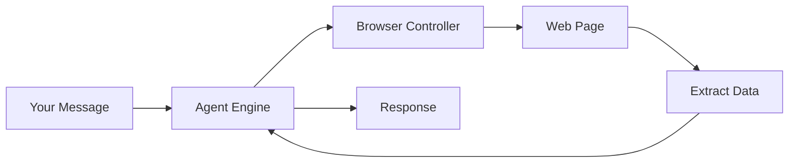

# Module 07: Browser Automation

> **Level:** Advanced | **Time:** 1 hour | **Prerequisites:** [Module 01](../01-getting-started/), [Module 06](../06-automation/)

Control a web browser through natural language — research, fill forms, extract data, and automate web workflows.

---

## What You'll Learn

- How browser automation works in OpenClaw
- Headless vs visible mode
- Web research with source citations
- Form filling and data entry
- Web scraping and data extraction
- Visual testing and screenshot workflows
- Security considerations

---

## How It Works

OpenClaw uses a headless (or visible) browser engine to interact with web pages programmatically:



The browser can:
- Navigate to URLs
- Click buttons and links
- Fill form fields
- Take screenshots
- Extract text, tables, and structured data
- Handle authentication (login flows)
- Wait for dynamic content (JavaScript-rendered pages)

---

## Configuration

```yaml
# config.yaml
permissions:
  browser:
    enabled: true
    headless: true                # true = invisible, false = watch it work
    timeout: 30000                # ms per action
    screenshots: true             # save screenshots of each step
    screenshot_path: "~/.openclaw/screenshots"
    viewport:
      width: 1920
      height: 1080
    user_agent: "OpenClaw/1.0"    # or a standard browser UA
    allowed_domains: ["*"]        # restrict if needed
    blocked_domains:              # never visit these
      - "malware-site.com"
    download_path: "~/Downloads/openclaw"
    max_pages: 10                 # max concurrent tabs
    javascript: true              # enable JS execution
```

### Visible Mode (Debugging)

Set `headless: false` to watch OpenClaw navigate in a real browser window. Useful for:
- Debugging failed automations
- Verifying form fills before submission
- Understanding complex page interactions
- Demos and presentations

---

## Use Cases

### 1. Web Research with Citations

```
You: "Research the top 5 alternatives to Datadog for infrastructure
      monitoring in 2026. I need: pricing, key features, pros/cons,
      and best-for use cases. Include source links for every claim."
```

OpenClaw will:
1. Search the web for current information
2. Open multiple results in tabs
3. Extract relevant data from each page
4. Cross-reference claims across sources
5. Compile a structured report with citation links

**Output format:**

```markdown
## Infrastructure Monitoring Alternatives to Datadog (2026)

| Tool | Starting Price | Best For | Key Differentiator |
|---|---|---|---|
| Grafana Cloud | Free tier / $29/mo | OSS teams | Open-source, no vendor lock-in |
| New Relic | Free tier / $0.35/GB | Full-stack | Generous free tier |
| ... | ... | ... | ... |

### 1. Grafana Cloud
**Pricing:** Free tier includes 10k metrics... [source](https://grafana.com/pricing)
**Pros:** ...
**Cons:** ...
```

### 2. Form Filling

```
You: "Go to our company expense portal at expenses.acme.com.
      Log in as my account. Submit an expense report:
      - Date: March 28, 2026
      - Vendor: Blue Bottle Coffee
      - Amount: $47.50
      - Category: Client Entertainment
      - Description: Coffee meeting with Jane from DataCorp
      - Receipt: attach ~/Documents/receipts/bluebottle-0328.pdf
      Screenshot the confirmation page."
```

OpenClaw navigates, fills every field, uploads the receipt, submits, and sends you the confirmation screenshot.

### 3. Data Extraction / Scraping

```
You: "Go to our internal dashboard at dashboard.acme.com.
      Extract this month's sales numbers by region.
      Format as a CSV and save to ~/Documents/sales-march-2026.csv"
```

```
You: "Scrape the pricing page of these 5 competitors:
      - competitor1.com/pricing
      - competitor2.com/pricing
      - competitor3.com/pricing
      - competitor4.com/pricing
      - competitor5.com/pricing
      Extract all plan names, prices, and feature lists.
      Output as a comparison spreadsheet."
```

### 4. Visual Testing

```
You: "Open our staging site at staging.acme.com.
      1. Log in as test@acme.com / testpass123
      2. Navigate to the checkout flow
      3. Add item SKU-001 to cart
      4. Proceed to checkout
      5. Enter test payment details
      6. Verify the confirmation page shows 'Order Confirmed'
      7. Screenshot each step
      8. Report any visual anomalies or broken elements"
```

### 5. Automated Monitoring

```yaml
# Cron: check competitor pricing weekly
name: competitor-pricing-monitor
schedule: "0 8 * * 1"
action: |
  Visit these competitor pricing pages:
  - competitor1.com/pricing
  - competitor2.com/pricing
  - competitor3.com/pricing

  Compare current prices against the last check (in memory).
  If any prices changed, send me a Slack message with:
  - Which competitor
  - What changed (old price → new price)
  - Screenshot of the pricing page
```

### 6. Flight Check-In

```yaml
name: flight-checkin
trigger:
  type: calendar_event
  match: "flight|airline"
  offset: "-24h"
action: |
  A flight is coming up in 24 hours.
  Calendar event: {{ trigger.event }}

  1. Extract the airline name and confirmation number from the event
  2. Navigate to the airline's check-in page
  3. Enter the confirmation number
  4. Complete web check-in
  5. Download or screenshot the boarding pass
  6. Send the boarding pass to my WhatsApp
```

---

## Advanced Browser Techniques

### Handling Authentication

```yaml
# Store credentials securely
browser:
  saved_logins:
    - domain: "expenses.acme.com"
      username: ${ACME_USERNAME}
      password: ${ACME_PASSWORD}
    - domain: "dashboard.acme.com"
      username: ${DASH_USERNAME}
      password: ${DASH_PASSWORD}
      mfa: totp                    # handle TOTP if configured
      totp_secret: ${DASH_TOTP}
```

### Handling Dynamic Content

```
You: "The page at dashboard.acme.com loads data via JavaScript.
      Wait for the chart to render (look for the element with
      id='sales-chart') before taking a screenshot."
```

OpenClaw knows to wait for specific elements, AJAX calls, and JavaScript rendering before proceeding.

### Multi-Page Workflows

```
You: "Open 5 tabs:
      1. GitHub notifications
      2. Gmail inbox
      3. Linear board
      4. Our Grafana dashboard
      5. Hacker News front page

      For each, extract the key items and compile into a
      single summary. This is my 'state of the world' view."
```

### Cookie and Session Management

```yaml
browser:
  cookie_persistence: true         # maintain sessions across runs
  cookie_path: "~/.openclaw/cookies"
  clear_cookies_interval: "7d"     # auto-clear old cookies
```

---

## Screenshot Workflows

Screenshots are powerful for visual workflows:

```bash
# View recent screenshots
ls ~/.openclaw/screenshots/

# Screenshots are auto-named with timestamp and context
# 2026-03-28_14-30-22_expenses-acme-com_confirmation.png
```

### Sending Screenshots to Channels

```
You: "Take a screenshot of our production dashboard and send it
      to Slack #engineering-status"
```

### Screenshot Comparison

```
You: "Take a screenshot of staging.acme.com/homepage.
      Compare it to the last screenshot you took of this page.
      Report any visual differences."
```

---

## Security Considerations

### Domain Restrictions

```yaml
browser:
  allowed_domains:
    - "*.acme.com"                 # only internal sites
    - "github.com"
    - "gmail.com"
  blocked_domains:
    - "*.malware.com"
    - "*.phishing.com"
```

### Credential Safety

| Rule | Why |
|---|---|
| Store credentials in `.env`, never in config | Prevents accidental exposure |
| Use per-site credentials, not shared passwords | Limits blast radius |
| Enable MFA where possible | Extra security layer |
| Clear cookies regularly | Prevents session persistence attacks |
| Review saved logins quarterly | Remove unused credentials |

### Never Automate

- Financial transactions without human confirmation
- Deleting accounts or data
- Sending payments
- Legal or compliance submissions

Always require explicit human approval for irreversible actions.

---

## Troubleshooting

### Browser won't start

```bash
# Check if browser engine is installed
openclaw browser check

# Reinstall browser engine
openclaw browser install
```

### Page not loading

```bash
# Test with visible mode
openclaw config set permissions.browser.headless false

# Increase timeout
openclaw config set permissions.browser.timeout 60000

# Check network access
openclaw integration test browser
```

### Screenshots are blank

```bash
# Increase viewport size
openclaw config set permissions.browser.viewport.width 1920
openclaw config set permissions.browser.viewport.height 1080

# Wait for page load
# Add "wait 5 seconds after page load" to your prompt
```

---

## Key Takeaways

- Browser automation lets you interact with any website through natural language
- Use headless mode for speed, visible mode for debugging
- Web research with citations is one of the highest-value use cases
- Form filling and data extraction save hours of manual work
- Always restrict allowed domains and secure credentials
- Never automate irreversible financial or legal actions without confirmation

---

## What's Next

1. **[Module 08 - Workflows](../08-workflows/)** — Embed browser automation steps into larger multi-step pipelines
2. **[Module 06 - Automation](../06-automation/)** — Schedule browser tasks with cron or trigger them from events
3. **[Module 09 - Advanced Features](../09-advanced-features/)** — Domain restrictions, security hardening, and permission modes

For browser automation recipes and scraping patterns, see **[POWER_USER_PLAYBOOK.md](../POWER_USER_PLAYBOOK.md)**. For routine browser health checks, see **[OPERATIONS.md](../OPERATIONS.md)**. For a full command reference, see **[CATALOG.md](../CATALOG.md)**. For a guided path through all modules, see **[LEARNING-ROADMAP.md](../LEARNING-ROADMAP.md)**.

Browser automation failing? See the [Troubleshooting Guide](../TROUBLESHOOTING.md#8-browser-or-ui-automation-fails) for permission and selector debugging.
