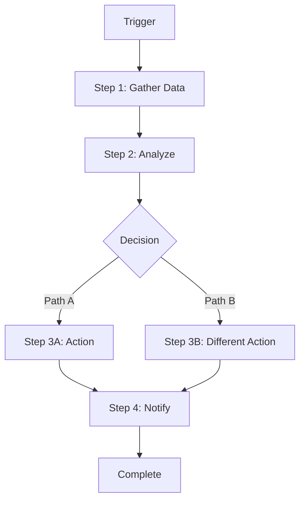
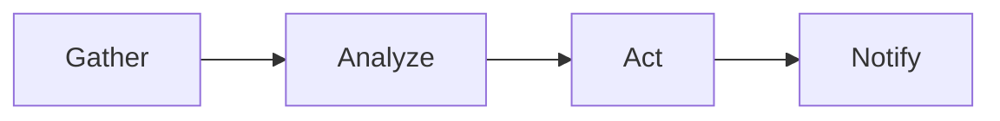

# Module 08: Workflows

> **Level:** Advanced | **Time:** 2 hours | **Prerequisites:** [Module 04](../04-skills/), [Module 05](../05-integrations/), [Module 06](../06-automation/)

Build multi-step, autonomous pipelines that combine skills, integrations, and automations into end-to-end workflows.

---

## What You'll Learn

- Workflow architecture and design patterns
- Building multi-step pipelines
- Error handling and fallback strategies
- Parallel execution
- Production-ready workflow templates
- Testing and monitoring workflows

---

## What Is a Workflow?

A workflow is a **multi-step autonomous pipeline** that coordinates skills, integrations, and tools to complete a complex task end-to-end.



**Skills** do one thing well. **Workflows** orchestrate multiple skills into a complete process.

---

## Workflow Architecture

```yaml
# workflow.yaml structure
name: workflow-name
description: What this workflow does
version: 1.0.0

# How to start the workflow
trigger:
  type: cron | webhook | keyword | calendar_event | file_watcher | condition
  # trigger-specific configuration

# User-configurable values
config:
  key: default_value

# The pipeline
steps:
  - name: step-name
    tool: shell | llm | browser | channel | skill
    # step-specific configuration
    condition: "optional condition to run this step"
    on_error: skip | abort | retry | fallback
    timeout: 60s

# Where to send results
output:
  channel: slack | telegram | whatsapp
  target: "#channel-name"
```

---

## Production Workflow Templates

### Workflow 1: Autonomous PR Pipeline

When a PR is opened, OpenClaw reviews the code, runs checks, posts a review, and notifies you only if human attention is needed.

```yaml
name: pr-pipeline
description: Autonomous code review and CI verification for new PRs
version: 1.0.0

trigger:
  type: webhook
  source: github
  event: pull_request
  action: [opened, synchronize]

config:
  repos:
    - "acme-corp/payments-api"
    - "acme-corp/frontend"
  auto_approve: false              # set true for trusted repos
  review_depth: thorough           # quick | standard | thorough

steps:
  - name: fetch_pr
    tool: github
    action: get_pr_details
    repo: "{{ trigger.repo }}"
    pr_number: "{{ trigger.pr_number }}"

  - name: get_diff
    tool: github
    action: get_diff
    repo: "{{ trigger.repo }}"
    pr_number: "{{ trigger.pr_number }}"

  - name: check_ci
    tool: github
    action: get_check_runs
    repo: "{{ trigger.repo }}"
    ref: "{{ fetch_pr.head_sha }}"
    wait_for_completion: true
    timeout: 600s

  - name: review_code
    tool: llm
    model: claude-opus-4-6          # use the best model for code review
    prompt: |
      Review this pull request:

      **Title:** {{ fetch_pr.title }}
      **Author:** {{ fetch_pr.author }}
      **Description:** {{ fetch_pr.body }}

      **Diff:**
      ```
      {{ get_diff.output }}
      ```

      Review for:
      1. Logic errors and bugs
      2. Security vulnerabilities (OWASP top 10)
      3. Performance issues (N+1 queries, memory leaks, etc.)
      4. Error handling gaps
      5. Style and readability

      **CI Status:** {{ check_ci.status }}
      {{ check_ci.failures if any }}

      Format your review as:
      - **Summary:** One sentence overview
      - **Issues:** Numbered list of problems with severity (critical/major/minor)
      - **Suggestions:** Improvements that aren't bugs
      - **Verdict:** APPROVE / REQUEST_CHANGES / COMMENT

  - name: post_review
    tool: github
    action: create_review
    repo: "{{ trigger.repo }}"
    pr_number: "{{ trigger.pr_number }}"
    event: "{{ review_code.verdict }}"
    body: "{{ review_code.output }}"

  - name: auto_approve
    tool: github
    action: approve_pr
    condition: "{{ config.auto_approve }} && {{ review_code.verdict }} == 'APPROVE' && {{ check_ci.status }} == 'success'"
    repo: "{{ trigger.repo }}"
    pr_number: "{{ trigger.pr_number }}"

  - name: notify
    tool: channel
    condition: "{{ review_code.verdict }} == 'REQUEST_CHANGES'"
    target: slack
    message: |
      PR #{{ trigger.pr_number }} in {{ trigger.repo }} needs attention.
      Author: {{ fetch_pr.author }}
      Issues found: {{ review_code.issue_count }}
      Link: {{ fetch_pr.url }}
```

### Workflow 2: Meeting Autopilot

```yaml
name: meeting-autopilot
description: End-to-end meeting lifecycle — prep, notes, follow-up
version: 1.0.0

trigger:
  type: calendar_event
  match: "*"
  offset: "-10m"

steps:
  # ── Pre-Meeting (10 min before) ──

  - name: get_meeting_context
    tool: llm
    prompt: |
      A meeting is starting in 10 minutes:
      **Title:** {{ trigger.event.title }}
      **Attendees:** {{ trigger.event.attendees }}
      **Description:** {{ trigger.event.description }}

      Prepare a briefing:
      1. Key topics from the agenda/description
      2. Relevant context from my memory about these attendees
      3. Any open action items from past meetings with these people
      4. Suggested talking points

  - name: send_prep
    tool: channel
    target: telegram
    message: |
      **Meeting Prep: {{ trigger.event.title }}**
      {{ get_meeting_context.output }}

  # ── During Meeting (join and take notes) ──

  - name: join_meeting
    tool: integration
    service: zoom
    action: join
    meeting_url: "{{ trigger.event.meeting_url }}"
    condition: "{{ trigger.event.meeting_url contains 'zoom' }}"

  - name: take_notes
    tool: llm
    stream: true                    # real-time note-taking
    prompt: |
      Take detailed notes for this meeting.
      Capture: decisions, action items, key points, and who said what.

  # ── Post-Meeting (after event ends) ──

  - name: format_notes
    trigger_on: calendar_event_ended
    tool: llm
    prompt: |
      Clean up and format these meeting notes:
      {{ take_notes.output }}

      Format as:
      ## Meeting: {{ trigger.event.title }}
      **Date:** {{ trigger.event.date }}
      **Attendees:** {{ trigger.event.attendees }}

      ### Key Decisions
      - [numbered list]

      ### Action Items
      - [ ] [action] — **Owner:** [name] — **Due:** [date]

      ### Notes
      [organized by topic]

  - name: create_tasks
    skill: task-manager
    action: create_batch
    tasks: "{{ format_notes.action_items }}"

  - name: post_to_slack
    tool: channel
    target: slack
    channel: "{{ trigger.event.slack_channel || '#general' }}"
    message: "{{ format_notes.output }}"

  - name: draft_followup
    tool: llm
    prompt: |
      Draft a follow-up email to the meeting attendees:
      {{ trigger.event.attendees }}

      Based on these notes:
      {{ format_notes.output }}

      Include: summary, action items with owners, and next steps.
      Tone: professional, concise.

  - name: queue_email
    skill: email-manager
    action: draft
    to: "{{ trigger.event.attendees }}"
    subject: "Meeting Notes: {{ trigger.event.title }}"
    body: "{{ draft_followup.output }}"
    # Draft only — don't send without approval
```

### Workflow 3: Research-to-Decision Pipeline

```yaml
name: research-to-decision
description: Deep research on a topic, produce a structured decision document
version: 1.0.0

trigger:
  type: keyword
  match: "research and decide|decision doc|compare options"

steps:
  - name: clarify_scope
    tool: llm
    prompt: |
      The user wants a research-based decision document.
      Their request: "{{ trigger.message }}"

      Extract:
      1. The decision to be made
      2. Options to compare
      3. Key criteria/constraints
      4. Timeline/urgency

  - name: web_research
    tool: browser
    action: research
    queries:
      - "{{ clarify_scope.option_1 }} review 2026"
      - "{{ clarify_scope.option_2 }} review 2026"
      - "{{ clarify_scope.option_1 }} vs {{ clarify_scope.option_2 }}"
      - "{{ clarify_scope.option_1 }} pricing"
      - "{{ clarify_scope.option_2 }} pricing"
    max_pages: 15
    extract: structured

  - name: analyze
    tool: llm
    model: claude-opus-4-6
    prompt: |
      Based on this research:
      {{ web_research.output }}

      And these constraints:
      {{ clarify_scope.criteria }}

      Produce a decision document:

      ## Decision: {{ clarify_scope.decision }}

      ### Executive Summary
      [2-3 sentences with recommendation]

      ### Comparison Matrix
      | Criterion | {{ option_1 }} | {{ option_2 }} |
      |---|---|---|
      [fill for each criterion]

      ### Detailed Analysis
      [section for each option with pros, cons, cost]

      ### Recommendation
      [clear recommendation with confidence level and reasoning]

      ### Risks and Mitigations
      [what could go wrong with the recommended option]

      Cite sources for every factual claim.

  - name: deliver
    tool: channel
    target: "{{ trigger.source_channel }}"
    message: "{{ analyze.output }}"

  - name: save_to_notes
    skill: note-taker
    action: create
    title: "Decision Doc: {{ clarify_scope.decision }}"
    content: "{{ analyze.output }}"
    tags: ["decision", "research"]
```

### Workflow 4: Incident Response

```yaml
name: incident-response
description: Automated incident triage and coordination
version: 1.0.0

trigger:
  type: webhook
  source: pagerduty
  # Also works with: opsgenie, grafana, custom webhook

steps:
  - name: gather_context
    parallel: true
    substeps:
      - name: get_logs
        tool: shell
        command: "kubectl logs -n prod {{ trigger.service }} --tail=200 --since=10m"
        on_error: skip

      - name: get_pods
        tool: shell
        command: "kubectl get pods -n prod -l app={{ trigger.service }} -o wide"
        on_error: skip

      - name: get_metrics
        tool: browser
        action: screenshot
        url: "https://grafana.internal/d/{{ trigger.service }}-overview"
        on_error: skip

      - name: get_recent_deploys
        tool: shell
        command: "kubectl rollout history deployment/{{ trigger.service }} -n prod | tail -5"
        on_error: skip

  - name: diagnose
    tool: llm
    model: claude-opus-4-6
    prompt: |
      **INCIDENT ALERT**
      Service: {{ trigger.service }}
      Severity: {{ trigger.severity }}
      Alert: {{ trigger.message }}

      **Logs (last 10 min):**
      {{ gather_context.get_logs.output }}

      **Pod Status:**
      {{ gather_context.get_pods.output }}

      **Dashboard Screenshot:** [attached]
      {{ gather_context.get_metrics.screenshot }}

      **Recent Deployments:**
      {{ gather_context.get_recent_deploys.output }}

      Diagnose:
      1. Most likely root cause
      2. Immediate remediation steps
      3. Was this caused by a recent deployment?
      4. Blast radius assessment
      5. Recommended next actions

  - name: post_to_incident_channel
    tool: channel
    target: slack
    channel: "#incidents"
    message: |
      :rotating_light: **Incident: {{ trigger.service }}**
      **Severity:** {{ trigger.severity }}

      {{ diagnose.output }}

      **Dashboard:** https://grafana.internal/d/{{ trigger.service }}-overview
      **Logs:** `kubectl logs -n prod {{ trigger.service }} --tail=200 -f`

  - name: page_oncall
    tool: channel
    condition: "{{ trigger.severity }} == 'critical'"
    target: whatsapp
    message: |
      CRITICAL INCIDENT: {{ trigger.service }}
      {{ diagnose.summary }}
      Check #incidents on Slack for full details.
```

### Workflow 5: Personal CRM

```yaml
name: personal-crm
description: Track contacts, interactions, and follow-ups
version: 1.0.0

trigger:
  type: keyword
  match: "log interaction|met with|had coffee with|talked to|call with"

steps:
  - name: extract_details
    tool: llm
    prompt: |
      Extract contact interaction details from:
      "{{ trigger.message }}"

      Return structured data:
      - contact_name
      - company
      - role (if mentioned)
      - interaction_type (coffee, call, meeting, email)
      - date
      - key_topics (list)
      - opportunities (any business leads or opportunities mentioned)
      - follow_up_action (if mentioned)
      - follow_up_date (if mentioned, or suggest "2 weeks from now")

  - name: update_memory
    tool: memory
    action: upsert
    category: contacts
    key: "{{ extract_details.contact_name }}"
    data: "{{ extract_details }}"

  - name: create_follow_up
    skill: task-manager
    condition: "{{ extract_details.follow_up_action }}"
    action: create
    title: "Follow up with {{ extract_details.contact_name }}"
    due: "{{ extract_details.follow_up_date }}"
    notes: |
      Context: {{ extract_details.key_topics }}
      Opportunities: {{ extract_details.opportunities }}

  - name: confirm
    tool: channel
    target: "{{ trigger.source_channel }}"
    message: |
      Logged: {{ extract_details.interaction_type }} with {{ extract_details.contact_name }}
      ({{ extract_details.company }})
      Topics: {{ extract_details.key_topics | join(', ') }}
      Follow-up: {{ extract_details.follow_up_date || 'None set' }}
```

---

## Workflow Design Patterns

### Pattern 1: Gather → Analyze → Act → Notify

The most common pattern. Collect data from multiple sources, analyze it with LLM, take action, and notify.



### Pattern 2: Parallel Fanout

When you need data from multiple independent sources simultaneously:

```yaml
steps:
  - name: gather
    parallel: true
    substeps:
      - name: source_1
        tool: github
      - name: source_2
        tool: gmail
      - name: source_3
        tool: shell
  - name: combine
    tool: llm
    prompt: "Combine {{ source_1 }}, {{ source_2 }}, {{ source_3 }}"
```

### Pattern 3: Conditional Branching

```yaml
steps:
  - name: classify
    tool: llm
    prompt: "Classify this input..."

  - name: path_a
    condition: "{{ classify.result }} == 'urgent'"
    tool: channel
    target: whatsapp

  - name: path_b
    condition: "{{ classify.result }} == 'normal'"
    tool: channel
    target: telegram
```

### Pattern 4: Loop with Exit Condition

```yaml
steps:
  - name: check
    tool: shell
    command: "curl -s https://api.acme.com/health"

  - name: evaluate
    tool: llm
    prompt: "Is this healthy? {{ check.output }}"

  - name: retry
    condition: "{{ evaluate.result }} == 'unhealthy'"
    goto: check
    max_iterations: 5
    delay: 30s

  - name: alert
    condition: "{{ evaluate.result }} == 'unhealthy' && iterations >= 5"
    tool: channel
    target: whatsapp
    message: "Service unhealthy after 5 checks. Investigate."
```

---

## Error Handling

```yaml
steps:
  - name: risky_step
    tool: shell
    command: "some-command"
    on_error: fallback              # skip | abort | retry | fallback
    retry:
      attempts: 3
      delay: 5s
      backoff: exponential
    fallback:
      tool: channel
      target: telegram
      message: "Step 'risky_step' failed: {{ error.message }}"

  - name: critical_step
    tool: github
    on_error: abort                 # stop the entire workflow
    abort_message: "Workflow failed at critical_step. Manual intervention needed."
    abort_channel: slack
    abort_target: "#incidents"
```

### Resilience Patterns

Error handling is where production workflows stop being demos.

#### When to use each strategy

| Strategy | Use it when | Example |
|---|---|---|
| `skip` | the step enriches output but is not required for usefulness | weather failed, but the morning briefing should still go out |
| `abort` | continuing would create a misleading or dangerous result | PR diff failed to load, so code review must stop |
| `retry` | the failure is probably transient | HTTP timeout, flaky API, temporary rate limit |
| `fallback` | a degraded path is still useful | browser scrape failed, fall back to notify-only mode |

#### Design for partial success

A strong workflow distinguishes between:

- **core truth sources** — if these fail, abort
- **optional enrichments** — if these fail, skip or fallback
- **delivery paths** — if the primary path fails, try a backup notification route

#### Avoid silent failure

A workflow that fails quietly for three days is worse than one that fails loudly once.

Good practices:

- send failure alerts for critical workflows
- keep workflow outputs scannable
- review recent history regularly
- add explicit notify/fallback steps when human attention is needed

#### Start with notify-first automation

For new workflows, use this maturity ladder:

1. notify only
2. draft
3. execute with approval
4. full autonomy

That sequence dramatically reduces the chance of shipping a clever but unsafe workflow.

---

## Testing Workflows

```bash
# Dry run — shows execution plan without running
openclaw workflow test pr-pipeline --dry-run

# Run with mock trigger data
openclaw workflow test pr-pipeline --mock-trigger '{"repo": "test", "pr_number": 1}'

# Run with verbose logging
openclaw workflow run pr-pipeline --verbose

# View execution history
openclaw workflow history pr-pipeline --last 10

# View a specific run's details
openclaw workflow run-details <run-id>
```

---

## Monitoring Workflows

```bash
# Dashboard view
openclaw workflow status --all

# Failure alerts
openclaw config set workflows.alert_on_failure true
openclaw config set workflows.failure_channel slack
openclaw config set workflows.failure_target "#workflow-alerts"
```

---

## Key Takeaways

- Workflows orchestrate skills, integrations, and tools into autonomous pipelines
- Start with the high-value workflows: PR pipeline, meeting autopilot, inbox-to-action
- Use parallel execution for independent data gathering
- Always include error handling and fallbacks
- Test with `--dry-run` and `--mock-trigger` before deploying
- Monitor workflows and set up failure alerts

---

## What's Next

1. **[Module 09 - Advanced Features](../09-advanced-features/)** — Model routing, error handling patterns, and performance optimization for workflows
2. **[OPERATIONS.md](../OPERATIONS.md)** — Weekly and monthly review routines to keep workflows healthy
3. **[POWER_USER_PLAYBOOK.md](../POWER_USER_PLAYBOOK.md)** — Real-world workflow recipes from power users

Workflow output wrong? See the [Troubleshooting Guide](../TROUBLESHOOTING.md#4-workflow-runs-but-gives-bad-output) for the four root causes and fix strategies.
