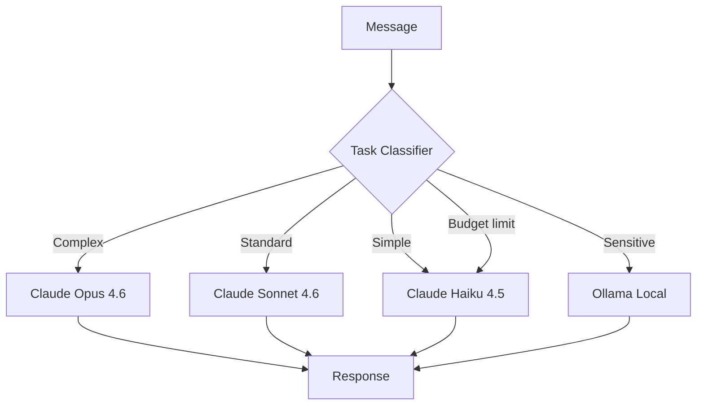

# Module 09: Advanced Features

> **Level:** Advanced | **Time:** 1.5 hours | **Prerequisites:** All previous modules

Master model routing, permission modes, security hardening, performance tuning, cost optimization, and advanced configuration.

---

## What You'll Learn

- Intelligent model selection and routing
- Permission modes and access control
- Security hardening best practices
- Performance optimization
- Cost management and budgeting
- Local model fallback
- Advanced configuration options

---

## Model Selection & Routing

### Available Models

| Provider | Model | Speed | Quality | Cost | Best For |
|---|---|---|---|---|---|
| Anthropic | Claude Opus 4.6 | Slow | Highest | $$$ | Complex reasoning, code review, analysis |
| Anthropic | Claude Sonnet 4.6 | Medium | High | $$ | Daily tasks, email, automation |
| Anthropic | Claude Haiku 4.5 | Fast | Good | $ | Quick queries, classification, routing |
| OpenAI | GPT-4.1 | Medium | High | $$ | Alternative to Sonnet |
| OpenAI | o3 | Slow | Highest | $$$ | Deep reasoning |
| DeepSeek | V3 | Fast | Good | $ | Budget-friendly alternative |
| Ollama | Llama 3.3 70B | Local | Good | Free | Airgapped, privacy-critical |

### Automatic Model Routing

Route tasks to the right model automatically based on complexity:

```yaml
# config.yaml
llm:
  default: claude-sonnet-4-6

  routing:
    # Complex tasks → best model
    - match: "review|analyze|debug|architect|decide|research"
      model: claude-opus-4-6
      reason: "High-stakes tasks deserve the best model"

    # Quick tasks → fastest model
    - match: "remind|weather|time|translate|convert"
      model: claude-haiku-4-5
      reason: "Simple tasks don't need Opus"

    # Code generation → balanced
    - match: "write|code|implement|refactor|test"
      model: claude-sonnet-4-6
      reason: "Good quality at reasonable cost"

    # Sensitive/private → local
    - match: "private|confidential|secret|internal"
      model: ollama/llama3.3:70b
      reason: "Never send sensitive content to cloud APIs"

    # Budget fallback
    - condition: "monthly_spend > budget * 0.8"
      model: claude-haiku-4-5
      reason: "Approaching budget limit"
```

### Per-Skill Model Override

```yaml
# config.yaml
skills:
  github-pr-reviewer:
    model: claude-opus-4-6           # always use best for code review

  inbox-triage:
    model: claude-haiku-4-5          # classification is simple

  research-agent:
    model: claude-opus-4-6           # deep research needs deep thinking
```

### Model Routing Architecture



---

## Permission Modes

### Six Permission Levels

| Mode | Shell | Filesystem | Browser | Config | Use Case |
|---|---|---|---|---|---|
| **Locked** | No | No | No | No | Read-only Q&A |
| **Restricted** | No | Read | No | No | Safe exploration |
| **Standard** | Sandboxed | Read-Write (scoped) | Headless | No | Daily use |
| **Trusted** | Full | Read-Write | Full | No | Power user |
| **Admin** | Full | Full | Full | Yes | Configuration |
| **Custom** | Configurable | Configurable | Configurable | Configurable | Fine-grained |

### Setting Permission Mode

```bash
# Set globally
openclaw config set permissions.mode standard

# Set per-channel
openclaw config set channels.whatsapp.permissions.mode restricted
openclaw config set channels.slack.permissions.mode trusted
```

### Custom Permission Profile

```yaml
# config.yaml
permissions:
  mode: custom
  custom:
    shell:
      enabled: true
      sandbox: true
      allowed_commands:
        - "git *"
        - "npm *"
        - "python *"
        - "kubectl get *"
        - "curl *"
      denied_commands:
        - "rm -rf *"
        - "sudo *"
        - "chmod 777 *"
        - "shutdown *"
        - "reboot *"
        - "kill -9 *"

    filesystem:
      read: true
      write: true
      allowed_paths:
        - "~/Documents"
        - "~/Projects"
        - "~/Downloads"
        - "/tmp/openclaw"
      denied_paths:
        - "~/.ssh"
        - "~/.gnupg"
        - "~/.aws/credentials"
        - "~/.kube/config"

    browser:
      enabled: true
      headless: true
      allowed_domains:
        - "*.acme.com"
        - "github.com"
        - "*.google.com"
        - "*.stackoverflow.com"

    network:
      enabled: true
      allowed_domains:
        - "api.anthropic.com"
        - "api.github.com"
        - "*.googleapis.com"
      max_request_size: "10MB"
      max_response_size: "50MB"
```

---

## Security Hardening

### Security Checklist

```
[ ] API keys in ~/.openclaw/.env, never in config.yaml
[ ] Server bound to 127.0.0.1, not 0.0.0.0
[ ] Auth token enabled for Control UI
[ ] Shell sandbox enabled
[ ] Destructive commands denied
[ ] Filesystem paths scoped
[ ] Sensitive file paths denied (~/.ssh, ~/.gnupg, ~/.aws)
[ ] Browser domains restricted (for internal use)
[ ] Per-channel permissions configured
[ ] Memory audited for sensitive data
[ ] Cookies cleared on schedule
[ ] Tokens rotated quarterly
```

### Sensitive Data Redaction

```yaml
# config.yaml
security:
  redaction:
    enabled: true
    patterns:
      # Credit card numbers
      - pattern: "\\b\\d{4}[- ]?\\d{4}[- ]?\\d{4}[- ]?\\d{4}\\b"
        replacement: "[REDACTED_CC]"

      # Social Security Numbers
      - pattern: "\\b\\d{3}-\\d{2}-\\d{4}\\b"
        replacement: "[REDACTED_SSN]"

      # Passwords in key=value format
      - pattern: "(password|passwd|secret|token)\\s*[=:]\\s*\\S+"
        replacement: "$1=[REDACTED]"
        case_insensitive: true

      # AWS keys
      - pattern: "AKIA[0-9A-Z]{16}"
        replacement: "[REDACTED_AWS_KEY]"

    # Files that should never be read
    never_read:
      - "*.pem"
      - "*.key"
      - "*.p12"
      - ".env*"
      - "*credentials*"
      - "*secret*"

    # Data never stored in memory
    never_memorize:
      - passwords
      - api_keys
      - tokens
      - credit_card_numbers
      - social_security_numbers
```

### Network Security

```yaml
security:
  network:
    # TLS verification
    tls_verify: true
    min_tls_version: "1.2"

    # Rate limiting
    rate_limits:
      global: 100/minute
      per_integration: 30/minute
      per_channel: 20/minute

    # Request logging
    log_requests: true
    log_path: "~/.openclaw/logs/network.log"
```

### Audit Logging

```yaml
security:
  audit:
    enabled: true
    log_path: "~/.openclaw/logs/audit.log"
    log_events:
      - shell_command
      - file_read
      - file_write
      - browser_navigation
      - integration_call
      - config_change
      - memory_write
      - memory_delete
    retention: 90d
```

View audit logs:

```bash
openclaw audit log --last 24h
openclaw audit log --filter shell_command --last 7d
openclaw audit log --filter file_write --path "~/Documents/*"
```

---

## Performance Optimization

### Response Latency

| Optimization | Impact | How |
|---|---|---|
| Use Haiku for simple tasks | 3-5x faster | Model routing config |
| Enable response caching | Instant for repeated queries | `cache.enabled: true` |
| Reduce max_tokens for simple tasks | Faster generation | Per-skill config |
| Use local models for non-critical tasks | Zero network latency | Ollama integration |
| Keep memory lean | Faster context assembly | Monthly pruning |

### Caching

```yaml
# config.yaml
performance:
  cache:
    enabled: true
    backend: local                 # local | redis
    ttl: 3600                      # default 1 hour
    max_size: "500MB"
    rules:
      # Cache web research for 24 hours
      - match: "browser.research"
        ttl: 86400

      # Cache integration reads for 5 minutes
      - match: "integration.*.read"
        ttl: 300

      # Never cache shell commands
      - match: "shell.*"
        ttl: 0

      # Never cache email sends
      - match: "integration.gmail.send"
        ttl: 0
```

### Concurrency

```yaml
performance:
  max_concurrent_tasks: 5          # parallel task limit
  max_concurrent_browser_tabs: 10
  max_concurrent_integrations: 20
  request_timeout: 120s            # global timeout
  task_queue_size: 100             # max queued tasks
```

### Memory Optimization

```bash
# Check memory size
openclaw memory stats

# Prune old entries
openclaw memory prune --older-than 90d

# Summarize verbose entries
openclaw memory optimize

# Check context assembly time
openclaw debug --profile "What's on my calendar?"
```

---

## Cost Management

### Budget Configuration

```yaml
# config.yaml
billing:
  monthly_budget: 50.00            # USD
  alert_thresholds:
    - percentage: 50
      channel: telegram
      message: "OpenClaw: 50% of monthly budget used"
    - percentage: 80
      channel: whatsapp
      message: "OpenClaw: 80% of monthly budget — switching to Haiku"
    - percentage: 95
      channel: whatsapp
      message: "OpenClaw: 95% of budget — pausing non-essential tasks"

  actions:
    at_80_percent: switch_to_haiku  # auto-downgrade model
    at_95_percent: essential_only   # only run critical automations
    at_100_percent: pause           # stop all automated tasks

  track_by:
    - skill                         # cost per skill
    - channel                       # cost per channel
    - model                         # cost per model
    - cron                          # cost per scheduled task
```

### Viewing Usage

```bash
# This month's total
openclaw usage --this-month

# By skill
openclaw usage --by skill --sort cost

# By model
openclaw usage --by model

# By day
openclaw usage --daily --last 30d

# Projected end-of-month
openclaw usage --projection
```

### Cost Reduction Strategies

| Strategy | Savings | Tradeoff |
|---|---|---|
| Route simple tasks to Haiku | 5-10x per task | Slightly lower quality |
| Enable response caching | Variable | Stale responses possible |
| Reduce cron frequency | Linear | Less real-time |
| Use local models for classification | 100% for those tasks | Slower, lower quality |
| Batch operations | 20-50% | Slight delay |
| Shorter max_tokens | 10-30% | Truncated responses |

---

## Local Model Fallback

Run OpenClaw with zero cloud API costs using Ollama:

### Setup

```bash
# Install Ollama
brew install ollama

# Pull a model
ollama pull llama3.3:70b

# Configure OpenClaw
openclaw config set llm.provider ollama
openclaw config set llm.model llama3.3:70b
```

### Hybrid Local/Cloud

```yaml
# config.yaml
llm:
  default: ollama/llama3.3:70b     # local by default

  routing:
    # Only use cloud for tasks that need it
    - match: "review|analyze|research"
      model: claude-opus-4-6

    # Everything else stays local
    - match: "*"
      model: ollama/llama3.3:70b
```

### When to Go Local

| Use Case | Local | Cloud |
|---|---|---|
| Quick Q&A | Yes | Overkill |
| Classification/routing | Yes | Overkill |
| Sensitive data processing | Yes (required) | No |
| Code review | Acceptable | Better |
| Deep research | Acceptable | Better |
| Complex reasoning | No | Yes |

---

## Advanced Configuration

### Full config.yaml Reference

```yaml
# ── LLM ──
llm:
  provider: anthropic
  model: claude-sonnet-4-6
  api_key: ${ANTHROPIC_API_KEY}
  max_tokens: 8192
  temperature: 0.3
  top_p: 0.9
  stop_sequences: []
  system_prompt: ""                # custom system prompt (advanced)

# ── Server ──
server:
  port: 3000
  host: "127.0.0.1"
  auth:
    enabled: true
    token: ${OPENCLAW_AUTH_TOKEN}
  cors:
    enabled: false
    origins: []

# ── Channels ──
channels:
  # See Module 02

# ── Memory ──
memory:
  backend: local
  persist_path: ~/.openclaw/memory
  auto_summarize: true
  auto_summarize_after: 7d
  max_context_tokens: 100000

# ── Permissions ──
permissions:
  mode: standard
  # See Permissions section above

# ── Cron ──
cron:
  enabled: true
  timezone: "Asia/Ho_Chi_Minh"
  max_concurrent: 3

# ── Skills ──
skills:
  directory: ~/.openclaw/skills
  auto_update: false
  # Per-skill overrides here

# ── Integrations ──
integrations:
  # See Module 05

# ── Performance ──
performance:
  cache:
    enabled: true
    ttl: 3600
    max_size: "500MB"
  max_concurrent_tasks: 5
  request_timeout: 120s

# ── Billing ──
billing:
  monthly_budget: 50.00
  track_by: [skill, channel, model]

# ── Security ──
security:
  redaction:
    enabled: true
  audit:
    enabled: true
  tls_verify: true

# ── Logging ──
logging:
  level: info                      # debug | info | warn | error
  path: ~/.openclaw/logs
  max_size: "100MB"
  retention: 30d
  structured: true                 # JSON format for log aggregation

# ── Routing ──
routing:
  rules: []
  # See Module 02

# ── Notifications ──
notifications:
  startup: telegram
  shutdown: telegram
  errors: slack
  budget_alerts: whatsapp
```

---

## Headless / CI Mode

Run OpenClaw non-interactively for CI/CD pipelines:

```bash
# Single command execution
openclaw run "Review the PR diff at $PR_URL and post a review comment" --headless

# Pipe input
echo "Summarize this log file" | openclaw run --stdin --headless < logfile.txt

# With JSON output
openclaw run "List open PRs" --headless --output json

# With exit code based on result
openclaw run "Are there any critical vulnerabilities in the latest security scan?" \
  --headless --exit-code-on "yes=1,no=0"
```

### GitHub Actions Example

```yaml
# .github/workflows/openclaw-review.yml
name: AI Code Review
on: [pull_request]

jobs:
  review:
    runs-on: ubuntu-latest
    steps:
      - uses: actions/checkout@v4
      - uses: openclaw/setup-action@v1
        with:
          api-key: ${{ secrets.ANTHROPIC_API_KEY }}
      - run: |
          openclaw run "Review this PR for bugs and security issues. \
            Post your review as a GitHub comment." --headless
```

---

## Key Takeaways

- Model routing saves money without sacrificing quality — use the right model for each task
- Permission modes protect you from accidental damage — start with Standard
- Security hardening is essential — redact sensitive data, restrict paths, enable audit logs
- Performance tuning: cache, model routing, memory pruning, and concurrency limits
- Set a monthly budget and auto-downgrade when approaching limits
- Local models via Ollama provide a free, privacy-first fallback
- Headless mode enables CI/CD integration
