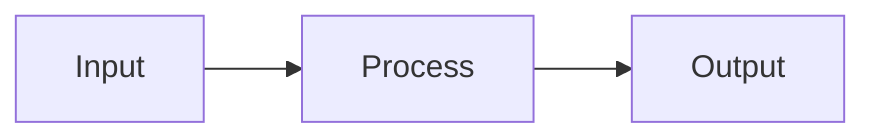

# Contributing to OpenClaw How-To

Thank you for your interest in improving this guide. Every contribution -- whether a typo fix, a new workflow template, or a full translation -- helps the 247,000+ developers who rely on OpenClaw daily.

---

## Table of Contents

- [Types of Contributions](#types-of-contributions)
- [Getting Started](#getting-started)
- [Writing Standards](#writing-standards)
- [Style Guide](#style-guide)
- [Security Guidelines](#security-guidelines)
- [Submitting Your Contribution](#submitting-your-contribution)
- [Pre-Submission Checklist](#pre-submission-checklist)
- [Code of Conduct](#code-of-conduct)
- [Getting Help](#getting-help)

---

## Types of Contributions

We welcome the following types of contributions:

| Type | Description | Example |
|---|---|---|
| **Templates** | Production-ready configs, skill definitions, workflow YAML | A new `skill.yaml` for Jira integration |
| **Documentation** | Improvements to existing modules, new sections, clarifications | Expanding the memory module with advanced patterns |
| **Guides** | Step-by-step tutorials for specific use cases | "How to set up a CI/CD monitoring pipeline" |
| **Translations** | Translating modules into other languages | A `zh/` directory with Chinese translations |
| **Bug Reports** | Reporting errors, broken examples, or outdated information | A config example that references a deprecated flag |
| **Fixes** | Typo corrections, broken link repairs, formatting fixes | Correcting a code block that lost its indentation |

If you are unsure whether your idea fits, open a [discussion](https://github.com/openclaw/openclaw-howto/discussions) first.

---

## Getting Started

1. **Fork** this repository.
2. **Clone** your fork locally:
   ```bash
   git clone https://github.com/<your-username>/openclaw-howto.git
   cd openclaw-howto
   ```
3. **Create a branch** following the naming convention below.
4. **Make your changes** following the writing standards and style guide.
5. **Submit a pull request** against the `trunk` branch.

---

## Writing Standards

### Heading Hierarchy

Every document must follow a strict heading hierarchy:

- `#` (H1) -- Document title. Exactly one per file.
- `##` (H2) -- Major sections.
- `###` (H3) -- Subsections.
- `####` (H4) -- Sub-subsections. Use sparingly.

Never skip a level (e.g., jumping from H2 to H4).

### Code Examples

- Every code example must be **tested and working** against the current stable release of OpenClaw.
- Use fenced code blocks with explicit language identifiers:
  ````markdown
  ```bash
  openclaw skill install email-manager
  ```
  ````
- For configuration files, use the appropriate language tag (`yaml`, `json`, `toml`).
- Include comments in code blocks to explain non-obvious lines.
- If a command requires elevated privileges or has side effects, note that clearly before the code block.

### Accuracy

- Do not invent flags, commands, or features. Every example must correspond to real OpenClaw functionality.
- If referencing a specific OpenClaw version, state the version explicitly.
- Link to the official docs when describing behavior that may change between releases.

### No Secrets

- **Never** include real API keys, tokens, passwords, or other credentials in examples.
- Use clearly fake placeholders: `YOUR_API_KEY_HERE`, `sk-xxxxxxxxxxxx`, `<token>`.
- See [Security Guidelines](#security-guidelines) for more detail.

---

## Style Guide

### Markdown Formatting

| Element | Convention |
|---|---|
| Line length | No hard wrap; one sentence per line preferred for clean diffs |
| Lists | Use `-` for unordered lists, `1.` for ordered lists |
| Bold | `**text**` for key terms on first use and UI element names |
| Italic | `*text*` for emphasis and publication/product names |
| Inline code | `` `backticks` `` for commands, flags, file names, and values |
| Links | `[descriptive text](URL)` -- never use "click here" |
| Images | Store in `assets/` with descriptive filenames; include alt text |
| Dashes | Use `--` (double hyphen) for em-dashes in prose |

### Table Format

Use the pipe-delimited format with header separators. Align content for readability in source:

```markdown
| Column A | Column B | Column C |
|---|---|---|
| Value 1 | Value 2 | Value 3 |
| Value 4 | Value 5 | Value 6 |
```

### Mermaid Diagrams

Use Mermaid for architecture and flow diagrams. Wrap in fenced code blocks with the `mermaid` language tag:

````markdown

````

Guidelines for Mermaid diagrams:

- Keep diagrams focused -- one concept per diagram.
- Use descriptive node labels, not abbreviations.
- Prefer `graph LR` (left-to-right) for pipelines and `graph TD` (top-down) for hierarchies.
- Test rendering on GitHub before submitting.

### File and Directory Naming

- Module directories: `NN-kebab-case/` (e.g., `07-browser-automation/`).
- Supporting files: `UPPER_CASE.md` for root-level documents.
- Asset files: `kebab-case.png` in the `assets/` directory.

---

## Security Guidelines

This guide is read by thousands of developers who may copy examples directly into production. Treat every example as if it will be deployed as-is.

### No Hardcoded Secrets

```yaml
# BAD - never do this
api_key: "sk-abc123realkey456"

# GOOD - use environment variables
api_key: "${OPENCLAW_API_KEY}"
```

### Use Environment Variables

All credentials, tokens, and sensitive configuration values must reference environment variables or a secrets manager. Show the setup step:

```bash
export OPENCLAW_API_KEY="YOUR_API_KEY_HERE"
```

### Warn About Security Implications

When a configuration grants elevated privileges (e.g., `permission_mode: full`, broad file-system access, outbound network rules), include a warning callout:

```markdown
> **Warning:** This configuration grants OpenClaw full file-system access.
> Review the [permissions guide](09-advanced-features/) before using in production.
```

### Sensitive Data Handling

- Never include real email addresses, usernames, or personal data in examples.
- Use `user@example.com`, `Jane Doe`, and similar RFC 2606-compliant placeholders.
- If a workflow involves personal data (health, finance), note applicable privacy considerations.

---

## Submitting Your Contribution

### Branch Naming

Use the following prefixes:

| Prefix | Use Case | Example |
|---|---|---|
| `feat/` | New templates, guides, or modules | `feat/notion-sync-guide` |
| `fix/` | Bug fixes, typo corrections | `fix/broken-link-module-04` |
| `docs/` | Documentation improvements | `docs/clarify-memory-stack` |
| `translate/` | Translations | `translate/spanish-module-01` |

### Commit Messages

Follow [Conventional Commits](https://www.conventionalcommits.org/):

```
<type>(<scope>): <description>

[optional body]

[optional footer]
```

Examples:

```
feat(workflows): add incident response template

docs(memory): clarify difference between core and episodic memory

fix(getting-started): correct brew install command for Linux
```

Types: `feat`, `fix`, `docs`, `style`, `refactor`, `test`, `chore`.

### Pull Request Template

When opening a PR, include:

```markdown
## What

Brief description of what this PR adds or changes.

## Why

The problem this solves or the gap it fills.

## Type of Change

- [ ] New template or guide
- [ ] Improvement to existing content
- [ ] Bug fix (broken example, typo, dead link)
- [ ] Translation
- [ ] Other (describe below)

## Testing

- [ ] All code examples have been tested against OpenClaw stable
- [ ] Mermaid diagrams render correctly on GitHub
- [ ] Links resolve to valid destinations
- [ ] No secrets, tokens, or personal data included
```

### Review Process

1. A maintainer will review your PR within 5 business days.
2. You may receive feedback requesting changes -- this is normal and collaborative.
3. Once approved, a maintainer will merge your PR into `trunk`.
4. Significant contributions will be credited in the [CHANGELOG](CHANGELOG.md).

---

## Pre-Submission Checklist

Before opening your pull request, verify:

- [ ] **Heading hierarchy** is correct (H1 > H2 > H3 > H4, no skipped levels).
- [ ] **Code examples** are fenced with language tags and have been tested.
- [ ] **No secrets** -- all credentials use placeholders or environment variables.
- [ ] **Links** work and point to the correct destinations.
- [ ] **Mermaid diagrams** render correctly (preview on GitHub or use a local renderer).
- [ ] **Tables** use the pipe-delimited format with header separators.
- [ ] **Security warnings** are present where configurations grant elevated access.
- [ ] **Spelling and grammar** have been checked.
- [ ] **Branch name** follows the naming convention.
- [ ] **Commit messages** follow Conventional Commits format.
- [ ] **PR description** follows the template above.
- [ ] **No large binaries** -- images are optimized and under 500 KB each.

---

## Code of Conduct

This project follows the [Contributor Covenant v2.1](https://www.contributor-covenant.org/version/2/1/code_of_conduct/).

### Summary

- **Be respectful.** Disagreement is fine; personal attacks are not.
- **Be inclusive.** Welcome contributors regardless of experience level, identity, or background.
- **Be constructive.** When reviewing others' work, offer specific, actionable suggestions.
- **Be patient.** Not everyone has the same context. Explain rather than dismiss.
- **No harassment.** Harassment, discrimination, and unwelcome behavior of any kind will not be tolerated.

### Enforcement

Violations may be reported to the maintainers at **conduct@openclaw.ai**. All reports will be reviewed promptly and confidentially. Maintainers reserve the right to remove, edit, or reject contributions that violate this code of conduct, and to temporarily or permanently ban contributors for repeated or severe violations.

---

## Getting Help

- **Questions about contributing:** Open a [discussion](https://github.com/openclaw/openclaw-howto/discussions).
- **Bug reports:** Open an [issue](https://github.com/openclaw/openclaw-howto/issues) using the bug report template.
- **Community chat:** Join us on [Discord](https://discord.gg/openclaw).
- **OpenClaw-specific questions:** See the [official docs](https://docs.openclaw.ai) or the [OpenClaw community forum](https://community.openclaw.ai).

---

Thank you for helping make OpenClaw accessible to everyone.
