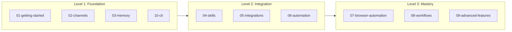
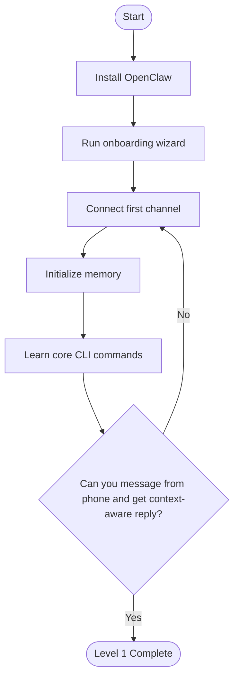
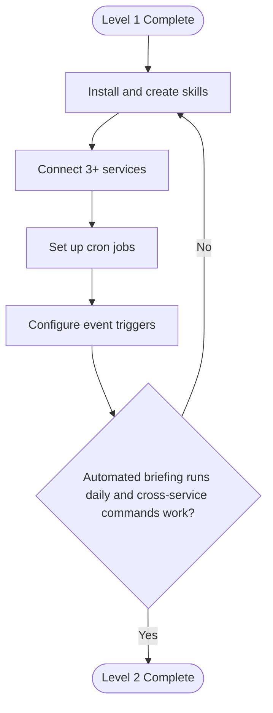
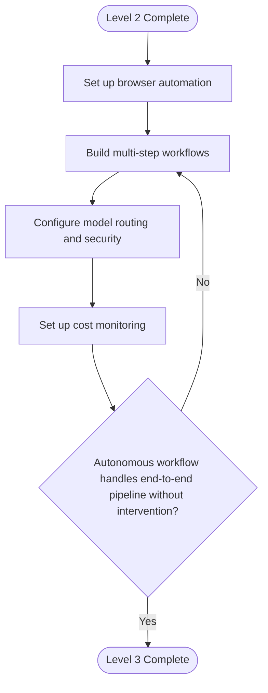
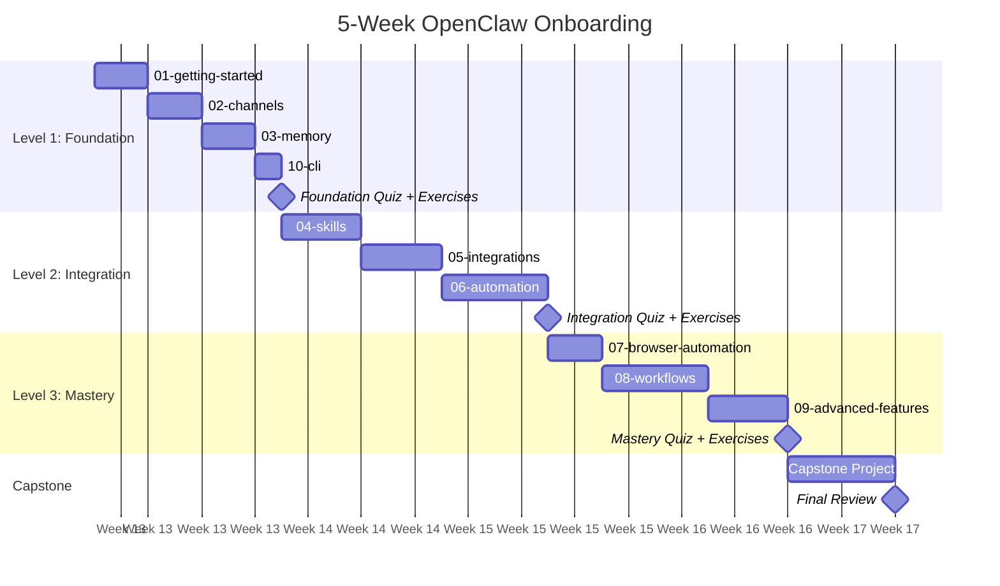
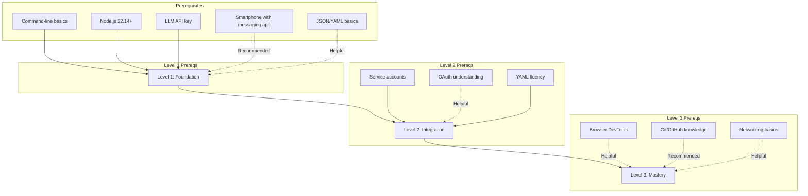
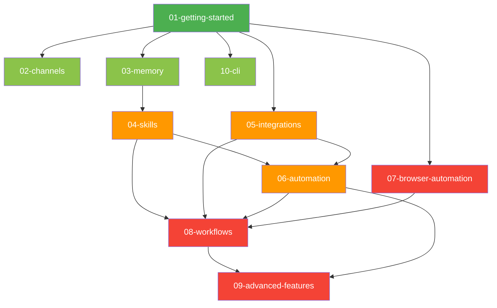
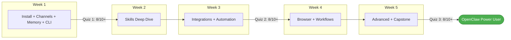

# Learning Roadmap

> A structured, three-level progression from OpenClaw beginner to power user. Includes self-assessment quizzes, a 5-week onboarding timeline, hands-on exercises, and a role-based decision matrix for choosing what to learn next.

---

## Table of Contents

- [Overview](#overview)
- [Learning Levels](#learning-levels)
  - [Level 1: Foundation (Beginner)](#level-1-foundation-beginner)
  - [Level 2: Integration (Intermediate)](#level-2-integration-intermediate)
  - [Level 3: Mastery (Advanced)](#level-3-mastery-advanced)
- [Self-Assessment Quizzes](#self-assessment-quizzes)
  - [Quiz 1: Foundation](#quiz-1-foundation)
  - [Quiz 2: Integration](#quiz-2-integration)
  - [Quiz 3: Mastery](#quiz-3-mastery)
- [5-Week Onboarding Timeline](#5-week-onboarding-timeline)
- [Prerequisites by Level](#prerequisites-by-level)
- [Success Criteria and Graduation Requirements](#success-criteria-and-graduation-requirements)
- [Hands-On Exercises](#hands-on-exercises)
  - [Foundation Exercises](#foundation-exercises)
  - [Integration Exercises](#integration-exercises)
  - [Mastery Exercises](#mastery-exercises)
- [Decision Matrix: What to Learn Next](#decision-matrix-what-to-learn-next)
- [Progression Map](#progression-map)

---

## Overview

This roadmap turns the 10 modules of the OpenClaw Howto Guide into a structured learning journey. Whether you have 45 minutes or 5 weeks, you will know exactly what to study, in what order, and how to verify that you have internalized the material before moving on.



| Metric | Level 1 | Level 2 | Level 3 |
|---|---|---|---|
| **Study Time** | 3-4 hours | 4-5 hours | 4-5 hours |
| **Modules** | 4 | 3 | 3 |
| **Key Outcome** | Running assistant with channels and memory | Custom skills, 50+ integrations, scheduled automation | Autonomous multi-step workflows in production |

---

## Learning Levels

### Level 1: Foundation (Beginner)

**Goal:** Install OpenClaw, connect at least one messaging channel, configure persistent memory, and become fluent with the CLI.

| Module | Time | Milestone |
|---|---|---|
| [01-getting-started](01-getting-started/) | 45 min | OpenClaw is installed, onboarding wizard completed, first successful interaction via the Control UI |
| [02-channels](02-channels/) | 45 min | At least one messaging platform connected (WhatsApp, Telegram, Slack, or Discord) and responding to messages |
| [03-memory](03-memory/) | 45 min | Memory initialized with your profile, preferences stored, and context persisting across conversations |
| [10-cli](10-cli/) | 30 min | Comfortable running `openclaw start`, `openclaw status`, `openclaw config`, and at least 10 other CLI commands from memory |

**You are done with Level 1 when you can:**

1. Send a message from your phone (via WhatsApp/Telegram) and receive an accurate, context-aware reply from OpenClaw.
2. Ask OpenClaw about something you told it yesterday, and get the right answer from memory.
3. Run `openclaw status` and explain every line of the output.



---

### Level 2: Integration (Intermediate)

**Goal:** Extend OpenClaw with skills and service integrations, then automate recurring tasks with cron and event triggers.

| Module | Time | Milestone |
|---|---|---|
| [04-skills](04-skills/) | 1.5 hrs | Installed 3+ community skills, created 1 custom skill with `skill.yaml`, and successfully chained 2 skills together |
| [05-integrations](05-integrations/) | 1 hr | Connected at least 3 external services (e.g., Gmail + GitHub + Notion) and verified data flows correctly |
| [06-automation](06-automation/) | 1.5 hrs | At least 2 cron jobs running (e.g., morning briefing + EOD summary) and 1 event-driven trigger configured |

**You are done with Level 2 when you can:**

1. Tell OpenClaw "Summarize my unread emails and create Todoist tasks for anything urgent" and watch it execute across integrations without manual help.
2. Receive an automated morning briefing every day at 7 AM covering calendar, email, and GitHub notifications.
3. Modify a community skill's `skill.yaml` to change its behavior and reload it without restarting OpenClaw.



---

### Level 3: Mastery (Advanced)

**Goal:** Build fully autonomous, multi-step workflows with browser automation, advanced model routing, security hardening, and production monitoring.

| Module | Time | Milestone |
|---|---|---|
| [07-browser-automation](07-browser-automation/) | 1 hr | Browser session running headless, capable of scraping a target website and extracting structured data into a JSON file |
| [08-workflows](08-workflows/) | 2 hrs | At least 1 multi-step workflow deployed (e.g., PR review pipeline or meeting autopilot) with error handling and fallback logic |
| [09-advanced-features](09-advanced-features/) | 1.5 hrs | Model routing configured (fast model for triage, powerful model for analysis), permission modes locked down, cost monitoring active |

**You are done with Level 3 when you can:**

1. Deploy a workflow that triggers on a GitHub webhook, reviews the PR with browser-based visual regression, posts a Slack summary, and creates follow-up tasks — autonomously, end to end.
2. Explain your model routing strategy and why you chose it.
3. Show a cost dashboard and demonstrate that your automation runs within a defined monthly budget.



---

## Self-Assessment Quizzes

Use these quizzes to check your understanding before moving to the next level. Score yourself honestly. **8/10 or higher means you are ready to advance.**

### Quiz 1: Foundation

| # | Question | Answer |
|---|---|---|
| 1 | What are the three installation methods for OpenClaw? | Homebrew, npm global install, build from source |
| 2 | What command runs the guided first-time setup? | `openclaw onboard` |
| 3 | Name four messaging channels OpenClaw supports. | WhatsApp, Telegram, Slack, Discord (also: iMessage, Email, Signal, Teams, Matrix, IRC, etc.) |
| 4 | What is the purpose of the Control UI? | Web dashboard for monitoring, configuration, and direct interaction with OpenClaw |
| 5 | How do you check OpenClaw's running status from the CLI? | `openclaw status` |
| 6 | What are the four layers of OpenClaw's memory stack? | Working Memory (current conversation), Short-Term Memory (last 7 days), Long-Term Memory (persistent facts), Episodic Memory (timestamped events) |
| 7 | How do you explicitly teach OpenClaw a fact about yourself? | `openclaw memory add "fact"` or tell it directly in conversation with "Remember that..." |
| 8 | What is the default permission mode after onboarding? | Standard mode (sandboxed shell, scoped read-write filesystem) |
| 9 | How do you view all installed channels and their connection status? | `openclaw channel list` |
| 10 | What happens to memory when you restart OpenClaw? | It persists. Memory is stored on disk and survives restarts. |

---

### Quiz 2: Integration

| # | Question | Answer |
|---|---|---|
| 1 | What file defines a custom skill? | `skill.yaml` |
| 2 | How do you install a skill from the community registry? | `openclaw skill install <skill-name>` |
| 3 | What is skill chaining? | Invoking one skill from within another to build multi-capability pipelines |
| 4 | Name the three-level skill loading architecture. | System skills, user skills, project skills (loaded in priority order) |
| 5 | What command lists all connected integrations and their auth status? | `openclaw integration list` |
| 6 | How does OpenClaw authenticate with third-party services? | OAuth2 flows, API keys, or token-based auth depending on the service |
| 7 | What is the cron syntax for "every weekday at 7 AM"? | `0 7 * * 1-5` |
| 8 | Name two types of automation triggers besides cron. | Webhook triggers and event-driven triggers (file watcher, calendar event, keyword, condition) |
| 9 | How do you test a cron job without waiting for the schedule? | `openclaw cron run <job-name>` |
| 10 | What is the difference between a skill and a workflow? | A skill does one thing well. A workflow orchestrates multiple skills, integrations, and tools into a multi-step pipeline. |

---

### Quiz 3: Mastery

| # | Question | Answer |
|---|---|---|
| 1 | What browser engine does OpenClaw use for headless automation? | Chromium (via Playwright/Puppeteer) |
| 2 | How do you run a browser task in visible (non-headless) mode? | Set `headless: false` in the browser step config or use `--visible` flag |
| 3 | What are the four workflow trigger types? | `cron`, `webhook`, `keyword`, `calendar_event` (also `file_watcher` and `condition`) |
| 4 | How does a workflow handle a failed step? | Via the `on_error` field: `skip`, `abort`, `retry`, or `fallback` |
| 5 | What is model routing and why use it? | Directing different tasks to different LLM models based on complexity, speed, or cost requirements |
| 6 | Name the six permission modes in order of restrictiveness. | Locked (no access), Restricted (read-only), Standard (sandboxed), Trusted (full shell), Admin (full + config), Custom (configurable) |
| 7 | How do you set a monthly cost budget for OpenClaw? | `openclaw config set billing.monthly_budget <amount>` and enable cost monitoring |
| 8 | What is a network policy and when would you use one? | A rule restricting which domains/APIs OpenClaw can access. Used for security hardening in production. |
| 9 | How do you enable local model fallback when the API is unavailable? | Configure a local model (e.g., Ollama) as a fallback provider in `config.yaml` |
| 10 | What command exports a workflow as a shareable template? | `openclaw workflow export <workflow-name>` |

---

## 5-Week Onboarding Timeline

A realistic schedule for professionals learning OpenClaw alongside a full-time job. Each week requires roughly 2-3 hours of study plus daily usage time.



### Week-by-Week Breakdown

| Week | Modules | Focus | Daily Practice |
|---|---|---|---|
| **Week 1** | 01, 02, 03, 10 | Install, connect channels, set up memory, learn the CLI | Send at least 5 messages to OpenClaw daily through a connected channel |
| **Week 2** | 04 | Skills deep dive: install 5 community skills, write 1 custom skill | Use a new skill every day; modify one skill's configuration |
| **Week 3** | 05, 06 | Connect 3+ integrations, build 2 cron jobs and 1 event trigger | Every morning, review your automated briefing and refine it |
| **Week 4** | 07, 08 | Browser automation basics, build your first multi-step workflow | Run a browser scraping task and incorporate its output into a workflow |
| **Week 5** | 09 + Capstone | Model routing, security, cost optimization, capstone project | Deploy your capstone workflow to production and monitor for one week |

### Suggested Daily Routine During Onboarding

```
Morning (15 min)    Review automated briefing, check for errors in cron logs
Study (30-45 min)   Work through module material for the current week
Practice (15 min)   Complete one hands-on exercise or experiment
Evening (10 min)    Review what OpenClaw did during the day, refine memory/config
```

---

## Prerequisites by Level

### Level 1: Foundation

| Prerequisite | Required | Notes |
|---|---|---|
| Command-line basics (cd, ls, cat) | Yes | You will use the terminal extensively |
| Node.js 22.14+ installed | Yes | Runtime requirement |
| An LLM API key (OpenAI, Anthropic, or other) | Yes | At least one provider |
| A smartphone with WhatsApp or Telegram | Recommended | For testing channel connectivity |
| Familiarity with JSON/YAML | Helpful | Config files use these formats |

### Level 2: Integration

| Prerequisite | Required | Notes |
|---|---|---|
| Level 1 complete (all milestones met) | Yes | Builds directly on foundation knowledge |
| Accounts on services you want to integrate | Yes | Gmail, GitHub, Notion, Todoist, etc. |
| Basic understanding of APIs and OAuth | Helpful | Integration auth flows use OAuth2 |
| Cron syntax familiarity | Helpful | Review [crontab.guru](https://crontab.guru) if unfamiliar |
| YAML fluency | Yes | Skills and automations are defined in YAML |

### Level 3: Mastery

| Prerequisite | Required | Notes |
|---|---|---|
| Level 2 complete (all milestones met) | Yes | Workflows depend on skills and integrations |
| Understanding of browser DevTools | Helpful | For debugging browser automation selectors |
| Git and GitHub workflow knowledge | Recommended | Many advanced workflows integrate with GitHub |
| Basic networking concepts (ports, DNS, TLS) | Helpful | For network policies and security hardening |
| Cost awareness of LLM API pricing | Recommended | You will configure budgets and model routing |



---

## Success Criteria and Graduation Requirements

Each level has a set of objective, verifiable criteria. All items marked **Required** must be completed before advancing.

### Level 1: Foundation Graduation

| # | Criterion | Type | Verification |
|---|---|---|---|
| 1 | OpenClaw installed and running | Required | `openclaw status` returns "running" |
| 2 | At least one channel connected and active | Required | `openclaw channel list` shows a connected channel |
| 3 | Memory initialized with personal profile | Required | `openclaw memory search "name"` returns your name |
| 4 | At least 20 successful interactions logged | Required | `openclaw log count` shows 20+ entries |
| 5 | Can explain the memory stack (3 layers) | Required | Pass Quiz 1 Question 6 |
| 6 | Can navigate the Control UI dashboard | Required | Demonstrate during review |
| 7 | Comfortable with 10+ CLI commands | Required | Pass Quiz 1 with 8/10+ |
| 8 | Two channels connected simultaneously | Bonus | Extra credit for multi-channel setup |

### Level 2: Integration Graduation

| # | Criterion | Type | Verification |
|---|---|---|---|
| 1 | 3+ community skills installed and tested | Required | `openclaw skill list` shows 3+ active skills |
| 2 | 1 custom skill created with `skill.yaml` | Required | Skill file exists and `openclaw skill test <name>` passes |
| 3 | 2 skills chained into a pipeline | Required | Demonstrate chain execution end to end |
| 4 | 3+ external services integrated | Required | `openclaw integration list` shows 3+ connected services |
| 5 | 2 cron jobs running reliably | Required | `openclaw cron list` shows 2+ active jobs, logs show 3+ successful runs each |
| 6 | 1 event-driven trigger configured | Required | `openclaw trigger list` shows 1+ active trigger |
| 7 | Morning briefing automated | Required | Briefing received for 3 consecutive days |
| 8 | Custom skill published to registry | Bonus | `openclaw skill publish` completed successfully |

### Level 3: Mastery Graduation

| # | Criterion | Type | Verification |
|---|---|---|---|
| 1 | Browser automation task running headless | Required | `openclaw browser status` shows active sessions |
| 2 | 1 multi-step workflow deployed | Required | `openclaw workflow list` shows active workflow |
| 3 | Workflow includes error handling (on_error) | Required | `workflow.yaml` contains `on_error` directives |
| 4 | Model routing configured with 2+ models | Required | `openclaw config get model.routing` shows routing rules |
| 5 | Permission mode configured appropriately | Required | Can explain current permission mode and why it was chosen |
| 6 | Cost monitoring enabled with monthly budget | Required | `openclaw config get billing.monthly_budget` returns a value |
| 7 | Network policy defined | Required | `openclaw config get security.network_policy` returns rules |
| 8 | Capstone project: end-to-end autonomous workflow | Required | See [Capstone Exercise](#exercise-m-3-capstone-autonomous-pr-pipeline) |
| 9 | Workflow shared as reusable template | Bonus | `openclaw workflow export` completed |

---

## Hands-On Exercises

Every exercise follows the same format: objective, step-by-step instructions, expected output, and how to verify success.

### Foundation Exercises

#### Exercise F-1: Hello, OpenClaw

**Objective:** Complete installation and have your first conversation.

**Steps:**

1. Install OpenClaw using your preferred method.
2. Run `openclaw onboard` and complete all five wizard steps.
3. Start OpenClaw with `openclaw start`.
4. Open the Control UI at `http://localhost:3000`.
5. Send the message: "Hello! What can you help me with?"
6. Send a follow-up: "What's the weather like?" (to test tool usage).

**Expected Output:** OpenClaw responds with its capabilities list, then provides weather information by calling an external tool.

**Verification:**
```bash
openclaw status        # Should show "running"
openclaw log last 2    # Should show both interactions
```

---

#### Exercise F-2: Multi-Channel Messaging

**Objective:** Connect two messaging channels and verify cross-channel memory.

**Steps:**

1. Connect WhatsApp (or Telegram) using `openclaw channel add whatsapp`.
2. Connect Slack (or Discord) using `openclaw channel add slack`.
3. From WhatsApp, send: "Remember that my favorite programming language is Rust."
4. From Slack, send: "What's my favorite programming language?"

**Expected Output:** OpenClaw replies on Slack with "Rust" — proving that memory is shared across channels.

**Verification:**
```bash
openclaw channel list                  # Two channels, both "connected"
openclaw memory search "programming"   # Should return the Rust fact
```

---

#### Exercise F-3: Memory Mastery

**Objective:** Build a comprehensive personal profile in memory and test recall.

**Steps:**

1. Add 10 facts about yourself using natural conversation:
   - Your name, role, company
   - Your timezone, work hours
   - Your preferred communication style
   - Your current projects
   - Your technical stack
   - Your meeting schedule patterns
2. Run `openclaw memory list` to inspect stored memories.
3. Ask OpenClaw: "Based on what you know about me, draft a professional bio."
4. Verify the bio is accurate and uses all relevant stored facts.

**Expected Output:** A well-written bio that references your stored profile data.

**Verification:**
```bash
openclaw memory list --type core       # Should show profile entries
openclaw memory search "timezone"      # Should return your timezone
```

---

#### Exercise F-4: CLI Proficiency Challenge

**Objective:** Demonstrate fluency with at least 15 CLI commands.

**Commands to execute (in order):**

```bash
openclaw --version                     # 1. Version check
openclaw status                        # 2. System status
openclaw config list                   # 3. View configuration
openclaw channel list                  # 4. List channels
openclaw memory list                   # 5. List memories
openclaw memory search "name"          # 6. Search memory
openclaw skill list                    # 7. List skills
openclaw integration list              # 8. List integrations
openclaw cron list                     # 9. List cron jobs
openclaw log last 10                   # 10. View recent logs
openclaw log search "error"            # 11. Search logs
openclaw config get model.provider     # 12. Get specific config
openclaw health                        # 13. Health check
openclaw debug on                      # 14. Enable debug mode
openclaw debug off                     # 15. Disable debug mode
```

**Verification:** All 15 commands execute without errors. Explain the output of any 5 of them.

---

### Integration Exercises

#### Exercise I-1: Skill Installation and Custom Skill

**Objective:** Install community skills, then create and test a custom skill.

**Steps:**

1. Install three community skills:
   ```bash
   openclaw skill install daily-briefing
   openclaw skill install email-manager
   openclaw skill install standup-reporter
   ```
2. Test each skill by invoking it via chat.
3. Create a custom skill called `project-status`:
   ```bash
   mkdir -p ~/.openclaw/skills/project-status
   ```
4. Write the `skill.yaml`:
   ```yaml
   name: project-status
   description: Generates a project status report from GitHub and Todoist
   version: 1.0.0
   trigger:
     keyword: "project status"
   tools:
     - github
     - todoist
   prompt: |
     Gather open PRs from GitHub and pending tasks from Todoist.
     Produce a status report grouped by project with completion percentages.
   output:
     format: markdown
   ```
5. Reload skills: `openclaw skill reload`
6. Test: Send "project status" to OpenClaw.

**Verification:**
```bash
openclaw skill list                    # Shows 3 community + 1 custom skill
openclaw skill test project-status     # Test passes
```

---

#### Exercise I-2: Integration Trifecta

**Objective:** Connect three services and execute a cross-integration command.

**Steps:**

1. Connect Gmail: `openclaw integration add gmail`
2. Connect GitHub: `openclaw integration add github`
3. Connect Notion (or Todoist): `openclaw integration add notion`
4. Verify all three: `openclaw integration list`
5. Send OpenClaw the message: "Check my Gmail for any emails from my GitHub notification sender, summarize them, and add a page to my Notion inbox for anything requiring action."

**Expected Output:** OpenClaw reads Gmail, filters GitHub notification emails, summarizes them, and creates Notion pages for actionable items.

**Verification:**
```bash
openclaw integration list              # All three show "authenticated"
openclaw log last 1 --verbose          # Shows tool calls to all three services
```

---

#### Exercise I-3: Automation Station

**Objective:** Set up two cron jobs and one event trigger.

**Steps:**

1. Create a morning briefing cron job:
   ```bash
   openclaw cron add morning-briefing \
     --schedule "0 7 * * 1-5" \
     --skill daily-briefing \
     --channel slack \
     --target "#personal"
   ```
2. Create an EOD summary cron job:
   ```bash
   openclaw cron add eod-summary \
     --schedule "0 17 * * 1-5" \
     --skill standup-reporter \
     --channel telegram
   ```
3. Create a GitHub PR event trigger:
   ```bash
   openclaw trigger add pr-notify \
     --source github \
     --event pull_request.opened \
     --action "Summarize this PR and send me a Slack message"
   ```
4. Test all three:
   ```bash
   openclaw cron run morning-briefing
   openclaw cron run eod-summary
   openclaw trigger test pr-notify
   ```

**Verification:**
```bash
openclaw cron list                     # Shows 2 active cron jobs
openclaw trigger list                  # Shows 1 active trigger
openclaw log search "morning-briefing" # Shows successful execution
```

---

### Mastery Exercises

#### Exercise M-1: Browser Automation

**Objective:** Scrape structured data from a website using headless browser automation.

**Steps:**

1. Send OpenClaw: "Go to Hacker News, scrape the top 10 stories, and save them as JSON."
2. Verify the JSON output file was created.
3. Modify the task to run headless (if it ran with a visible browser).
4. Chain it: "Scrape Hacker News top 10, then summarize each story in one sentence, and post the summary to Slack."

**Verification:**
```bash
openclaw browser status                # Shows completed session
cat ~/.openclaw/output/hackernews.json # Contains 10 entries with title, url, score
```

---

#### Exercise M-2: Workflow Builder

**Objective:** Create a multi-step workflow with conditional logic and error handling.

**Steps:**

1. Create `~/.openclaw/workflows/meeting-autopilot.yaml`:
   ```yaml
   name: meeting-autopilot
   description: Autonomous meeting preparation and follow-up
   version: 1.0.0

   trigger:
     type: calendar_event
     config:
       minutes_before: 15

   steps:
     - name: gather-context
       tool: llm
       prompt: "Retrieve all notes, emails, and tasks related to this meeting's attendees and topic."
       on_error: skip

     - name: prepare-brief
       tool: llm
       prompt: "Create a one-page meeting brief with context, agenda suggestions, and open questions."
       on_error: abort

     - name: send-brief
       tool: channel
       channel: slack
       target: "#meetings"
       message: "{{ steps.prepare-brief.output }}"
       on_error: retry
       retry_count: 3

     - name: post-meeting-summary
       tool: llm
       prompt: "After the meeting, summarize decisions, action items, and deadlines."
       trigger: manual
       on_error: fallback
       fallback: "Send a reminder to create the summary manually."

   output:
     channel: slack
     target: "#meetings"
   ```
2. Deploy: `openclaw workflow deploy meeting-autopilot`
3. Test: `openclaw workflow test meeting-autopilot --dry-run`
4. Review logs after a real meeting triggers it.

**Verification:**
```bash
openclaw workflow list                 # Shows "meeting-autopilot" as active
openclaw workflow logs meeting-autopilot --last 1  # Shows step execution details
```

---

#### Exercise M-3: Capstone -- Autonomous PR Pipeline

**Objective:** Build an end-to-end workflow that reviews pull requests autonomously, combining browser automation, skills, integrations, and multi-channel output.

**Steps:**

1. Create `~/.openclaw/workflows/pr-pipeline.yaml` with the following pipeline:

```
Trigger: GitHub webhook (pull_request.opened)
    |
    v
Step 1: Fetch PR diff and metadata (GitHub integration)
    |
    v
Step 2: Run code review skill (skill: github-pr-reviewer)
    |
    v
Step 3: Open PR preview URL in headless browser, take screenshot (browser automation)
    |
    v
Step 4: Compare screenshot against baseline for visual regression (browser automation)
    |
    v
Step 5: Post review comment on GitHub with findings (GitHub integration)
    |
    v
Step 6: If issues found, send Slack alert with severity (channel)
    |
    v
Step 7: Create follow-up task in Todoist/Notion (integration)
    |
    v
Step 8: Log results and update cost tracker (advanced features)
```

2. Deploy the workflow.
3. Open a test PR on a repository and watch the pipeline execute.
4. Verify each step completed in the workflow logs.
5. Confirm the GitHub review comment was posted.
6. Confirm the Slack alert was sent (if issues were found).
7. Confirm the follow-up task was created.

**Verification:**
```bash
openclaw workflow logs pr-pipeline --last 1  # All 8 steps show "completed"
openclaw cost report --this-month            # Pipeline cost is tracked
```

**This exercise serves as the capstone for Level 3 graduation.**

---

## Decision Matrix: What to Learn Next

Use this matrix to decide which module to prioritize based on your role and immediate needs.

### By Role

| Role | Start Here | Then | Then | Priority Modules |
|---|---|---|---|---|
| **Software Engineer** | 01-getting-started | 04-skills | 08-workflows | 04, 05 (GitHub), 08 |
| **DevOps / SRE** | 01-getting-started | 06-automation | 09-advanced-features | 06, 09, 08 |
| **Product Manager** | 01-getting-started | 02-channels | 05-integrations | 02, 05, 03 |
| **Designer** | 01-getting-started | 07-browser-automation | 02-channels | 07, 02, 04 |
| **Data Analyst** | 01-getting-started | 05-integrations | 07-browser-automation | 05, 07, 08 |
| **Founder / Solo Dev** | 01-getting-started | 06-automation | 08-workflows | 06, 08, 05 |
| **Team Lead** | 01-getting-started | 02-channels | 09-advanced-features | 02, 09, 06 |
| **Support Engineer** | 01-getting-started | 03-memory | 04-skills | 03, 04, 02 |

### By Goal

| Your Goal | Recommended Path | Estimated Time |
|---|---|---|
| "I want a personal AI on my phone" | 01 -> 02 -> 03 -> 10 | 3 hours |
| "I want to automate my morning routine" | 01 -> 02 -> 05 -> 06 | 5 hours |
| "I want autonomous code review" | 01 -> 04 -> 05 -> 08 | 6 hours |
| "I want to scrape data from websites" | 01 -> 07 | 2 hours |
| "I want my team using OpenClaw securely" | 01 -> 02 -> 09 | 4 hours |
| "I want to build custom AI skills" | 01 -> 03 -> 04 | 3.5 hours |
| "I want full end-to-end automation" | 01 -> 02 -> 03 -> 04 -> 05 -> 06 -> 07 -> 08 -> 09 -> 10 | 12 hours |

### Module Dependency Map

Use this diagram to understand which modules unlock which. You can skip modules that are not in your path, but you cannot skip a dependency.



**Legend:** Green = Foundation | Orange = Integration | Red = Mastery

---

## Progression Map

A summary visualization of the entire learning journey.



| Milestone | Checkpoint | Outcome |
|---|---|---|
| End of Week 1 | Foundation Quiz passed (8/10+), Exercises F-1 through F-4 complete | You have a working assistant responding on your phone |
| End of Week 3 | Integration Quiz passed (8/10+), Exercises I-1 through I-3 complete | You have skills, integrations, and daily automations running |
| End of Week 5 | Mastery Quiz passed (8/10+), Exercises M-1 through M-3 complete | You have production-grade autonomous workflows |

---

## What Comes After Level 3?

Once you have graduated all three levels, you are ready to:

1. **Contribute skills** to the [OpenClaw Community Registry](https://registry.openclaw.ai)
2. **Share workflow templates** via `openclaw workflow export` and the community repository
3. **Mentor others** using this roadmap as a teaching aid
4. **Contribute to this guide** -- see [CONTRIBUTING.md](CONTRIBUTING.md)
5. **Push the boundaries** -- combine OpenClaw with local models, build custom integrations, create novel workflow patterns

The best way to solidify your knowledge is to teach it. Consider writing a tutorial, recording a walkthrough, or answering questions on the [OpenClaw Discord](https://discord.gg/openclaw).

---

*This roadmap is part of the [Master OpenClaw in a Weekend](README.md) guide. For quick reference, see [QUICK_REFERENCE.md](QUICK_REFERENCE.md). For a complete feature inventory, see [CATALOG.md](CATALOG.md).*
