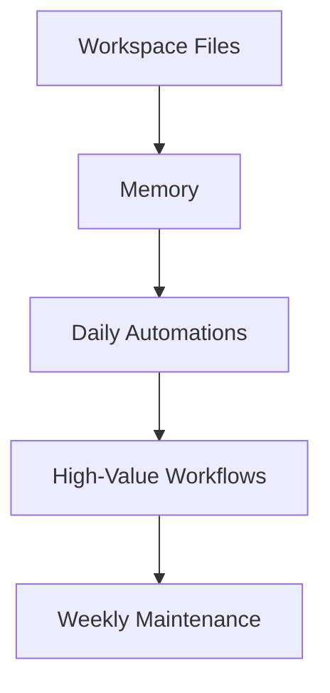

# OpenClaw Power User Playbook

> The shortest path from “assistant installed” to “assistant actually moving work for me every day.”

This guide is for builders, founders, engineers, and operators who want **throughput**, not novelty.

If your goal is to become “as productive as the OpenClaw author,” the answer is not one magic prompt. It is a stack:

1. **A good workspace** so the agent knows who it is helping
2. **A memory strategy** so repeated context stops costing time
3. **A small set of high-signal automations** that run every day
4. **A few strong workflows** that remove recurring decision overhead
5. **Weekly maintenance** so the system stays sharp instead of drifting

---

## The 2-Hour Setup That Actually Matters

If you only do five things, do these in order.

### 1. Get one channel you actually check

Do not connect six channels on day one. Connect **one** channel you already live in:

- Telegram for power-user control
- WhatsApp for personal/mobile use
- Slack for work

The first win is not omnipresence. The first win is **low-friction usage**.

### 2. Prime the workspace files

OpenClaw gets dramatically better when its workspace is explicit.

At minimum, fill in:

- `USER.md` — who you are, your role, timezone, how you like to work
- `TOOLS.md` — local repos, device names, SSH aliases, browser preferences, recurring commands
- `SOUL.md` / `AGENTS.md` — operating style and boundaries
- `HEARTBEAT.md` — a tiny checklist for periodic checks

Your goal is to eliminate repeat explanations like:

- “Use terse replies.”
- “I’m a backend engineer.”
- “Review PRs inline, not just summaries.”
- “Check GitHub and calendar, but don’t spam me.”

### 3. Give it a memory seed session

Do one deliberate “teach OpenClaw about me” conversation.

Include:

- role and current projects
- team structure and recurring meetings
- preferred communication style
- coding preferences and tool choices
- what “done” means for common requests
- what should always require approval

High-ROI examples:

- “When I ask for code, prefer production-ready code with error handling.”
- “When I say review a PR, leave inline comments on exact lines.”
- “Use Claude Code by default for coding unless I explicitly ask for something else.”
- “Don’t repeat unchanged alerts within 30 minutes.”

### 4. Turn on only 3 automations first

The best first automations are:

- **morning briefing**
- **PR review watch**
- **end-of-day summary**

That is enough to create daily leverage without turning your setup into a noisy science project.

### 5. Build one workflow that removes real toil

Pick only **one** of these first:

- PR triage/review workflow
- meeting prep/follow-up workflow
- inbox triage workflow
- research-to-decision workflow

Do not build five half-working automations. Build **one thing that saves you real time every week**.

---

## The Productivity Stack

Think in layers.



### Layer 1: Workspace Files

Workspace files reduce ambiguity.

**What to store where**

| File | What belongs there | Why |
|---|---|---|
| `USER.md` | role, timezone, style, preferences | removes repeated explanation |
| `TOOLS.md` | repo paths, SSH aliases, device names, local setup | speeds execution |
| `AGENTS.md` | operating rules, red lines, startup routine | keeps behavior stable |
| `SOUL.md` | tone/personality | improves interaction quality |
| `HEARTBEAT.md` | tiny recurring checklist | drives proactive behavior |

Good `USER.md` content is often more valuable than a fancy prompt.

### Layer 2: Memory

Memory is not “store everything forever.” Good memory is:

- durable
- compact
- actually reused
- periodically pruned

A good memory system stores:

- preferences that keep recurring
- important people and relationships
- project context with shelf life
- custom shorthand (“when I say ship it, run tests + build + push to staging”)

A bad memory system stores:

- every temporary detail
- secrets
- contradictory preferences
- obsolete project context from six months ago

### Layer 3: Daily Automations

These should be **boring and reliable**.

Start here:

#### Morning Briefing

What to include:

- calendar for next 24 hours
- top unread/urgent emails
- PRs awaiting review
- tasks due today
- weather if relevant

#### PR Review Watch

What to include:

- only PRs actually assigned/requested
- only PRs that are ready for review
- notify on new or materially changed PRs
- suppress unchanged repeats for at least 30 minutes

#### End-of-Day Summary

What to include:

- commits, reviews, merged PRs
- completed tasks
- unfinished items worth carrying forward
- tomorrow’s first meeting and top priorities

### Layer 4: High-Value Workflows

This is where output jumps.

#### Workflow A — PR Copilot on Steroids

**Best for:** engineers and team leads

Pipeline:

1. detect ready-for-review PR
2. fetch metadata and diff
3. analyze code and risk
4. leave inline comments on exact lines
5. submit APPROVE / REQUEST_CHANGES / COMMENT
6. notify only if attention is needed

This turns passive review backlog into active flow.

#### Workflow B — Meeting Autopilot

**Best for:** managers, PMs, leads

Pipeline:

1. pre-meeting brief
2. relevant context recall
3. notes capture
4. action item extraction
5. follow-up draft
6. task creation

This converts meetings from memory drains into structured outputs.

#### Workflow C — Research to Decision

**Best for:** founders, PMs, operators

Pipeline:

1. clarify the decision
2. gather sources
3. compare options
4. produce recommendation + risks
5. save/share decision doc

#### Workflow D — Inbox to Action

**Best for:** overloaded operators

Pipeline:

1. classify emails
2. summarize urgent ones
3. draft replies for action-required
4. archive noise
5. create tasks from real obligations

### Layer 5: Weekly Maintenance

The difference between a strong OpenClaw setup and a decaying one is maintenance.

Every week:

- inspect cron/workflow history
- prune noisy or low-value automations
- review cost hotspots
- update stale memories
- tighten prompts that keep failing

---

## The “Author-Level” Habits

If you want top-tier output, copy the habits, not just the configuration.

### 1. Write operating rules into files

Do not rely on “it should remember.”

If you want stable behavior, write it down in:

- workspace files
- memory files
- skill docs
- workflow templates

### 2. Keep automations tiny and composable

Small reliable jobs beat giant brittle ones.

Good:

- one heartbeat for 3 checks
- one cron for morning briefing
- one workflow for PR handling

Bad:

- one mega-workflow that checks mail, merges PRs, files receipts, and updates Notion

### 3. Prefer notify-first over auto-act at the beginning

Many people over-automate too early.

Safer progression:

1. notify me
2. draft for me
3. execute with approval
4. auto-execute only for well-understood paths

### 4. Tune for output, not just cleverness

Ask:

- did this save time?
- did this reduce context switching?
- did it reduce waiting?
- did it help me ship?

If not, it is a toy.

### 5. Review failures as product feedback

Every bad automation teaches you one of:

- wrong trigger
- wrong memory
- wrong prompt
- wrong permission boundary
- wrong notification policy

Treat failures as system tuning, not magic failure.

---

## A Strong Default Setup

If you want a practical default stack, use this.

### Channels

- **Telegram or Slack** as primary control surface
- one additional backup/notification surface only if needed

### Model Strategy

- strong default model for daily work
- cheaper/faster model for lightweight classification
- premium model only for high-stakes review/research
- local model only when privacy or cost requires it

### Permissions

- start at **Standard** for daily work
- elevate only where the gain is obvious
- use per-channel restrictions for public or mobile surfaces

### Skills / Integrations

Start with:

- GitHub
- calendar
- email
- tasks
- notes

You do not need 50 integrations to become productive.

### Automation Cadence

- morning briefing: once daily
- PR review watch: heartbeat or modest interval
- inbox triage: every 30–60 minutes during work hours
- EOD summary: weekdays only

---

## The First Week Plan

### Day 1 — Foundation

- install OpenClaw
- connect one channel
- fill in `USER.md` + `TOOLS.md`
- do memory seed conversation

### Day 2 — Daily Visibility

- create morning briefing
- create PR review watch
- test both manually

### Day 3 — Reduce Inbox Noise

- add inbox triage
- classify only; do not auto-send anything yet

### Day 4 — Add One Workflow

- choose one high-value workflow
- test it with a real input
- tune output format and notifications

### Day 5 — Stabilize

- prune bad alerts
- tighten memory
- check costs and logs
- write down patterns that worked

---

## Anti-Patterns That Kill Productivity

### 1. Too many channels

You do not need every channel. You need the right one.

### 2. Noisy heartbeat prompts

Heartbeats should be tiny checklists, not novels.

### 3. Storing secrets in memory

Use env vars and secret stores, not memory files.

### 4. Never pruning memory

Stale context degrades quality slowly and invisibly.

### 5. Auto-executing destructive actions too early

Notify/draft first. Full autonomy later.

### 6. Building complicated workflows before basic reliability

A flaky morning briefing is a warning sign. Fix basics before scaling.

---

## The Weekly Review Checklist

Run this every Friday or Sunday.

```markdown
## Weekly OpenClaw Review

- Which automation saved the most time?
- Which automation created the most noise?
- Which memory entries are stale or wrong?
- Which workflows failed this week?
- Which integrations need re-auth?
- What cost spikes showed up?
- What one improvement would most increase next week's output?
```

---

## Recommended Reading Order

If you are trying to maximize output fast:

1. [01 Getting Started](01-getting-started/)
2. [03 Memory](03-memory/)
3. [06 Automation](06-automation/)
4. [08 Workflows](08-workflows/)
5. [09 Advanced Features](09-advanced-features/)
6. [QUICK_REFERENCE.md](QUICK_REFERENCE.md)
7. [OPERATIONS.md](OPERATIONS.md)
8. [TROUBLESHOOTING.md](TROUBLESHOOTING.md)

---

## Final Rule

The best OpenClaw setups do not feel “AI-powered.”

They feel like:

- fewer context switches
- fewer forgotten tasks
- faster reviews
- better prepared meetings
- cleaner decisions
- more work shipped

That is the target.
