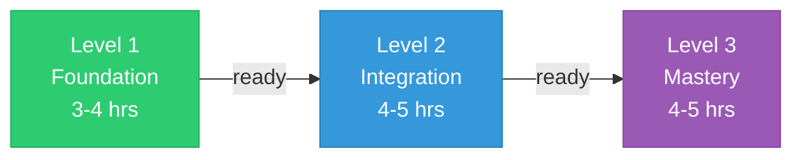
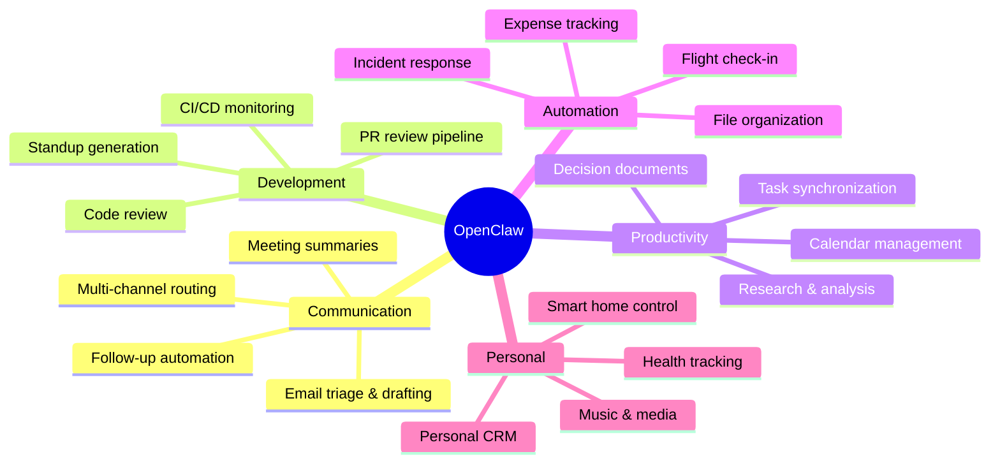

<div align="center">


<br/>
<br/>

# Master OpenClaw in a Weekend

<h3>
  <em>The ultimate guide to the #1 open-source AI assistant</em>
</h3>

<p>
  <strong>10 modules</strong> &bull; <strong>25+ templates</strong> &bull; <strong>9,500+ lines</strong> &bull; <strong>100% free</strong>
</p>

<br/>

<a href="https://github.com/dinhnhat0401/openclaw-howto/stargazers"></a>
&nbsp;
<a href="https://github.com/dinhnhat0401/openclaw-howto/network/members"></a>
&nbsp;
<a href="LICENSE"></a>
&nbsp;
<a href="https://github.com/openclaw/openclaw"></a>

<br/>
<br/>

<a href="#-quick-start"></a>
<a href="#-learning-path"></a>
<a href="#-10-modules"></a>
<a href="POWER_USER_PLAYBOOK.md"></a>
<a href="QUICK_REFERENCE.md"></a>
<a href="CATALOG.md"></a>
<a href="CONTRIBUTING.md"></a>

<br/>
<br/>

<table>
  <tr>
    <td align="center"><b>680+</b><br/><sub>hours saved/year</sub></td>
    <td align="center"><b>50+</b><br/><sub>integrations</sub></td>
    <td align="center"><b>15+</b><br/><sub>chat platforms</sub></td>
    <td align="center"><b>25+</b><br/><sub>ready templates</sub></td>
    <td align="center"><b>1</b><br/><sub>weekend to learn</sub></td>
  </tr>
</table>

<br/>

> **Love this guide?** Give it a **[star](https://github.com/dinhnhat0401/openclaw-howto/stargazers)** to help others find it.

<br/>

</div>

---

<br/>

## The Problem

OpenClaw has **247,000+ stars** and incredible docs. But docs describe features. They don't show you how to **combine** them.

<table>
<tr>
<td width="50%">

**What the docs tell you**

- Channels exist
- Skills are modular
- Cron jobs are possible
- Integrations are available

</td>
<td width="50%">

**What this guide shows you**

- Route urgent messages to WhatsApp, dev tasks to Slack, personal to Telegram — **automatically**
- Chain `email-manager` &rarr; `calendar-sync` &rarr; `task-manager` into an **autonomous pipeline**
- Build a morning briefing that runs at 7:30 AM with calendar + email + GitHub + weather
- Wire 50+ services into workflows that **save 13+ hours/week**

</td>
</tr>
</table>

<br/>

---

<br/>

## What's Inside

<div align="center">

<table>
<tr>
  <td align="center" width="150">
    <br/>
    <br/>
    <b>Tutorial<br/>Modules</b><br/>
    <sub>Beginner to Advanced</sub><br/><br/>
  </td>
  <td align="center" width="150">
    <br/>
    <br/>
    <b>Production<br/>Templates</b><br/>
    <sub>Copy-paste ready</sub><br/><br/>
  </td>
  <td align="center" width="150">
    <br/>
    <br/>
    <b>Service<br/>Integrations</b><br/>
    <sub>Gmail, GitHub, Notion...</sub><br/><br/>
  </td>
  <td align="center" width="150">
    <br/>
    <br/>
    <b>Architecture<br/>Diagrams</b><br/>
    <sub>Mermaid visualizations</sub><br/><br/>
  </td>
  <td align="center" width="150">
    <br/>
    <br/>
    <b>Learning<br/>Levels</b><br/>
    <sub>With self-assessment</sub><br/><br/>
  </td>
</tr>
</table>

</div>

<br/>

---

<br/>

## Quick Start

```bash
brew install openclaw-cli    # Install
openclaw onboard             # Setup wizard (API key, channels, permissions)
openclaw start               # Launch
```

Then message OpenClaw on any connected channel:

```
"What can you do?"
```

That's it. You're running. Now dive into the [modules](#-10-modules).

<br/>

---

<br/>

## Learning Path

<div align="center">



</div>

<br/>

<details>
<summary><b>Level 1: Foundation</b> &nbsp;  &nbsp; <code>3-4 hours</code></summary>
<br/>

| # | Module | Time | What You'll Learn |
|:---:|---|:---:|---|
| 01 | **[Getting Started](01-getting-started/)** | 45 min | Installation, configuration, first interaction |
| 02 | **[Channels](02-channels/)** | 45 min | Connect WhatsApp, Telegram, Slack, Discord, and more |
| 03 | **[Memory](03-memory/)** | 45 min | Persistent context, teaching OpenClaw about you |
| 10 | **[CLI Reference](10-cli/)** | 30 min | Every command at your fingertips |

</details>

<details>
<summary><b>Level 2: Integration</b> &nbsp;  &nbsp; <code>4-5 hours</code></summary>
<br/>

| # | Module | Time | What You'll Learn |
|:---:|---|:---:|---|
| 04 | **[Skills](04-skills/)** | 1.5 hrs | Install, create, and chain modular capabilities |
| 05 | **[Integrations](05-integrations/)** | 1 hr | Connect 50+ services (Gmail, GitHub, Notion, etc.) |
| 06 | **[Automation](06-automation/)** | 1.5 hrs | Cron jobs, event triggers, background tasks |

</details>

<details>
<summary><b>Level 3: Mastery</b> &nbsp;  &nbsp; <code>4-5 hours</code></summary>
<br/>

| # | Module | Time | What You'll Learn |
|:---:|---|:---:|---|
| 07 | **[Browser Automation](07-browser-automation/)** | 1 hr | Web research, form filling, data extraction |
| 08 | **[Workflows](08-workflows/)** | 2 hrs | Multi-step autonomous pipelines |
| 09 | **[Advanced Features](09-advanced-features/)** | 1.5 hrs | Model routing, permissions, security, performance |

</details>

<br/>

---

<br/>

## 10 Modules

<div align="center">

<table>
<tr>
<td align="center" width="33%">

### [01 Getting Started](01-getting-started/)
Install on macOS, Linux, Windows.<br/>Config walkthrough. First interaction.

 `45 min`

</td>
<td align="center" width="33%">

### [02 Channels](02-channels/)
15+ messaging platforms.<br/>Multi-channel routing. Permissions.

 `45 min`

</td>
<td align="center" width="33%">

### [03 Memory](03-memory/)
Persistent memory system.<br/>Teach OpenClaw about you.

 `45 min`

</td>
</tr>
<tr>
<td align="center">

### [04 Skills](04-skills/)
Install, create, and chain<br/>modular capabilities.

 `1.5 hrs`

</td>
<td align="center">

### [05 Integrations](05-integrations/)
Gmail, GitHub, Notion, Spotify<br/>and 50+ more services.

 `1 hr`

</td>
<td align="center">

### [06 Automation](06-automation/)
Cron jobs. Event triggers.<br/>24/7 background tasks.

 `1.5 hrs`

</td>
</tr>
<tr>
<td align="center">

### [07 Browser](07-browser-automation/)
Web research. Form filling.<br/>Data extraction. Testing.

 `1 hr`

</td>
<td align="center">

### [08 Workflows](08-workflows/)
Autonomous multi-step pipelines.<br/>PR review. Meeting autopilot.

 `2 hrs`

</td>
<td align="center">

### [09 Advanced](09-advanced-features/)
Model routing. Security.<br/>Performance. Cost control.

 `1.5 hrs`

</td>
</tr>
</table>

<br/>

**[10 CLI Reference](10-cli/)** &mdash; Every `openclaw` command documented &nbsp;  `30 min`

</div>

<br/>

---

<br/>

## Use Cases



<br/>

### Use Case → Module Map

| Use Case | Start Here | Then Add | Key Skill / Template |
|---|---|---|---|
| **Email triage & drafting** | [05 Integrations](05-integrations/) | [04 Skills](04-skills/) | `email-manager` skill, Gmail integration |
| **Meeting summaries** | [04 Skills](04-skills/) | [08 Workflows](08-workflows/) | `meeting-summarizer` skill, Meeting Autopilot workflow |
| **Follow-up automation** | [04 Skills](04-skills/) | [06 Automation](06-automation/) | `follow-up-tracker` skill, cron trigger |
| **Multi-channel routing** | [02 Channels](02-channels/) | — | Channel priority rules |
| **PR review pipeline** | [04 Skills](04-skills/) | [08 Workflows](08-workflows/) | `github-pr-reviewer` skill, PR Pipeline workflow |
| **Standup generation** | [06 Automation](06-automation/) | [04 Skills](04-skills/) | `standup-reporter` skill, 7:30 AM cron |
| **CI/CD monitoring** | [05 Integrations](05-integrations/) | [04 Skills](04-skills/) | `ci-monitor` skill, GitHub integration |
| **Code review** | [04 Skills](04-skills/) | [08 Workflows](08-workflows/) | `github-pr-reviewer` skill |
| **Calendar management** | [05 Integrations](05-integrations/) | [04 Skills](04-skills/) | `calendar-sync` skill |
| **Task synchronization** | [05 Integrations](05-integrations/) | [04 Skills](04-skills/) | `task-manager` skill, Todoist/Things integration |
| **Research & analysis** | [07 Browser](07-browser-automation/) | [04 Skills](04-skills/) | `research-agent` skill |
| **Decision documents** | [08 Workflows](08-workflows/) | [07 Browser](07-browser-automation/) | Research-to-Decision Pipeline |
| **File organization** | [06 Automation](06-automation/) | — | File watcher triggers |
| **Expense tracking** | [04 Skills](04-skills/) | [07 Browser](07-browser-automation/) | `expense-tracker` skill, receipt OCR |
| **Flight check-in** | [07 Browser](07-browser-automation/) | — | Form-filling automation |
| **Incident response** | [08 Workflows](08-workflows/) | [06 Automation](06-automation/) | Incident Response workflow template |
| **Smart home control** | [05 Integrations](05-integrations/) | — | Hue, Home Assistant, HomeKit |
| **Health tracking** | [05 Integrations](05-integrations/) | — | Apple Health (read-only) |
| **Personal CRM** | [03 Memory](03-memory/) | [04 Skills](04-skills/) | Memory system + custom skills |

> **Tip:** All use cases assume [01 Getting Started](01-getting-started/) is complete. See the [Learning Roadmap](LEARNING-ROADMAP.md#by-goal) for full learning paths.

<br/>

---

<br/>

## The Numbers

<div align="center">

<table>
<tr>
<th width="40%">Without OpenClaw</th>
<th width="40%">With OpenClaw</th>
<th width="20%">Saved</th>
</tr>
<tr><td>30 min reading emails</td><td>5 min AI-triaged inbox</td><td><b>25 min</b></td></tr>
<tr><td>45 min in status meetings</td><td>5 min reading auto-summaries</td><td><b>40 min</b></td></tr>
<tr><td>60 min on code review</td><td>15 min reviewing AI flags</td><td><b>45 min</b></td></tr>
<tr><td>20 min writing standups</td><td>2 min approve auto-generated</td><td><b>18 min</b></td></tr>
<tr><td>30 min scheduling</td><td>5 min confirming suggestions</td><td><b>25 min</b></td></tr>
<tr><td>45 min researching</td><td>10 min reviewing AI research</td><td><b>35 min</b></td></tr>
<tr><td>15 min organizing notes</td><td>0 min (automated)</td><td><b>15 min</b></td></tr>
<tr><td colspan="2" align="right"><b>Total daily savings:</b></td><td><b>~2h 43m</b></td></tr>
</table>

<br/>

<table>
<tr>
  <td align="center"><h2>13+</h2><sub>hours/week reclaimed</sub></td>
  <td align="center"><h2>680+</h2><sub>hours/year</sub></td>
  <td align="center"><h2>17</h2><sub>extra work weeks</sub></td>
</tr>
</table>

</div>

<br/>

---

<br/>

## Resources

<div align="center">

| | Document | What's Inside |
|:---:|---|---|
| **[POWER_USER_PLAYBOOK.md](POWER_USER_PLAYBOOK.md)** | Power User Playbook | The fastest path to a high-output OpenClaw setup: workspace files, memory, automations, workflows, and weekly maintenance |
| **[OPENCLAW_PRODUCTIVITY_STACK.md](OPENCLAW_PRODUCTIVITY_STACK.md)** | Productivity Stack | One-page blueprint for maximizing work output |
| **[TROUBLESHOOTING.md](TROUBLESHOOTING.md)** | Troubleshooting | Deep debugging for channels, cron, workflows, memory, auth, browser automation, and cost spikes |
| **[OPERATIONS.md](OPERATIONS.md)** | Operations Guide | Weekly/monthly maintenance, reliability habits, backup strategy, and scaling patterns |
| **[LEARNING-ROADMAP.md](LEARNING-ROADMAP.md)** | Learning Roadmap | 3-level progression, quizzes, 5-week timeline |
| **[QUICK_REFERENCE.md](QUICK_REFERENCE.md)** | Quick Reference | Cheat sheets, lookup tables, one-pagers |
| **[CATALOG.md](CATALOG.md)** | Feature Catalog | 95+ commands, 50+ integrations, all skills |
| **[CONTRIBUTING.md](CONTRIBUTING.md)** | Contributing | How to add modules, templates, translations |
| **[CHANGELOG.md](CHANGELOG.md)** | Changelog | Version history and release notes |

</div>

<br/>

---

<br/>

## Star History

<div align="center">
<a href="https://star-history.com/#dinhnhat0401/openclaw-howto&Date">
  <picture>
    <source media="(prefers-color-scheme: dark)" srcset="https://api.star-history.com/svg?repos=dinhnhat0401/openclaw-howto&type=Date&theme=dark" />
    <source media="(prefers-color-scheme: light)" srcset="https://api.star-history.com/svg?repos=dinhnhat0401/openclaw-howto&type=Date" />
    
  </picture>
</a>
</div>

<br/>

---

<br/>

## Share This Guide

<div align="center">

<a href="https://twitter.com/intent/tweet?text=Master%20OpenClaw%20in%20a%20Weekend%20%E2%80%94%20the%20ultimate%20guide%20to%20the%20%231%20open-source%20AI%20assistant%20(247K%2B%20%E2%AD%90)%0A%0A10%20modules%20%E2%80%A2%2025%2B%20templates%20%E2%80%A2%2050%2B%20integrations%0A%0Ahttps%3A%2F%2Fgithub.com%2Fdinhnhat0401%2Fopenclaw-howto"></a>
&nbsp;
<a href="https://www.linkedin.com/sharing/share-offsite/?url=https%3A%2F%2Fgithub.com%2Fdinhnhat0401%2Fopenclaw-howto"></a>
&nbsp;
<a href="https://reddit.com/submit?url=https%3A%2F%2Fgithub.com%2Fdinhnhat0401%2Fopenclaw-howto&title=Master%20OpenClaw%20in%20a%20Weekend%20%E2%80%94%20Ultimate%20Guide"></a>
&nbsp;
<a href="https://news.ycombinator.com/submitlink?u=https%3A%2F%2Fgithub.com%2Fdinhnhat0401%2Fopenclaw-howto&t=Master%20OpenClaw%20in%20a%20Weekend"></a>

</div>

<br/>

---

<br/>

## Contributing

We welcome contributions! See **[CONTRIBUTING.md](CONTRIBUTING.md)** for guidelines.

<table>
<tr>
<td>New workflow templates</td>
<td>Module improvements</td>
<td>Integration guides</td>
<td>Translations</td>
</tr>
</table>

<br/>

---

<br/>

## Support

<div align="center">

*If this guide saves you time, consider supporting its maintenance:*

<br/>

<a href="https://github.com/sponsors/dinhnhat0401"></a>
&nbsp;&nbsp;
<a href="https://buymeacoffee.com/nhataschooT"></a>

</div>

<br/>

---

<div align="center">

<br/>

**[docs.openclaw.ai](https://docs.openclaw.ai)** &nbsp;&bull;&nbsp; **[github.com/openclaw/openclaw](https://github.com/openclaw/openclaw)** &nbsp;&bull;&nbsp; **[discord.gg/openclaw](https://discord.gg/openclaw)**

<br/>

*Inspired by [claude-howto](https://github.com/luongnv89/claude-howto) by luongnv89*

<br/>

---

<br/>

**If this guide helped you, a [star](https://github.com/dinhnhat0401/openclaw-howto/stargazers) means the world.**

<sub>Made with care by the OpenClaw community.</sub>

<br/>

</div>
