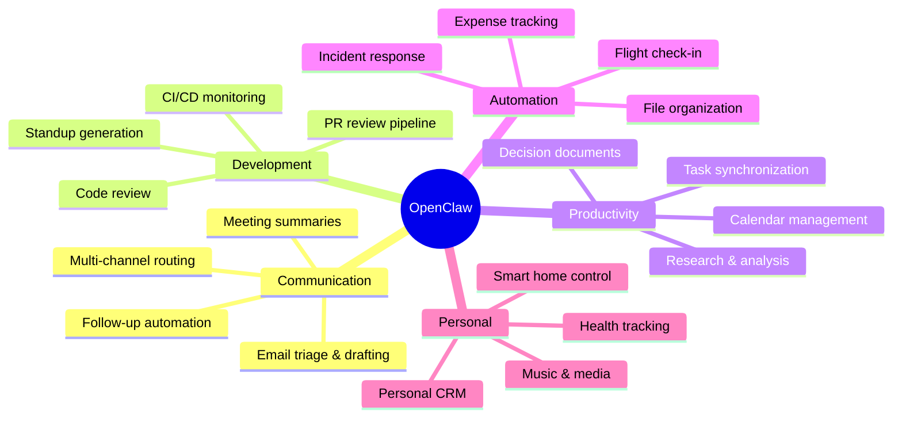

<div align="center">

# Master OpenClaw in a Weekend

### The definitive guide to the #1 open-source AI assistant

*Go from installation to fully autonomous productivity workflows in one weekend.*

<br/>

[](https://github.com/dinhnhat0401/openclaw-howto/stargazers)
[](https://github.com/dinhnhat0401/openclaw-howto/network/members)
[](LICENSE)
[](https://github.com/openclaw/openclaw)

[](https://github.com/dinhnhat0401/openclaw-howto/commits)
[](CONTRIBUTING.md)
[](#learning-path)
[](#use-cases-at-a-glance)

<br/>

**[Quick Start](#quick-start-15-minutes)** | **[Learning Path](#learning-path)** | **[Modules](#module-overview)** | **[Quick Reference](QUICK_REFERENCE.md)** | **[Catalog](CATALOG.md)**

<br/>

---

*If this guide helps you, please consider giving it a* **[star](https://github.com/dinhnhat0401/openclaw-howto/stargazers)** *— it helps others find it too.*

---

</div>

## The Problem This Guide Solves

OpenClaw's [official docs](https://docs.openclaw.ai) describe features. This guide shows you **how to combine them** into production workflows that save you hours every day.

The docs tell you channels exist. This guide shows you how to route urgent messages to WhatsApp, dev tasks to Slack, and personal reminders to Telegram — automatically.

The docs tell you skills are modular. This guide shows you how to chain `email-manager` → `calendar-sync` → `task-manager` into an autonomous inbox-to-action pipeline.

---

## What's Included

| Category | Contents |
|---|---|
| **10 Tutorial Modules** | Step-by-step guides from beginner to advanced |
| **Production-Ready Templates** | Copy-paste configs, skills, cron jobs, and workflows |
| **Architecture Diagrams** | Mermaid visualizations of every major subsystem |
| **Decision Matrices** | When to use what — channels, models, integrations |
| **Learning Roadmap** | Structured 3-level progression with self-assessment |
| **Quick Reference** | Cheat sheets, command tables, and lookup guides |
| **Feature Catalog** | Complete inventory of commands, skills, and integrations |

---

## Learning Path

### Level 1: Beginner (3-4 hours)

| Module | Time | What You'll Learn |
|---|---|---|
| [01 - Getting Started](01-getting-started/) | 45 min | Installation, configuration, first interaction |
| [02 - Channels](02-channels/) | 45 min | Connect WhatsApp, Telegram, Slack, Discord, and more |
| [03 - Memory](03-memory/) | 45 min | Persistent context, teaching OpenClaw about you |
| [10 - CLI Reference](10-cli/) | 30 min | Every command at your fingertips |

### Level 2: Intermediate (4-5 hours)

| Module | Time | What You'll Learn |
|---|---|---|
| [04 - Skills](04-skills/) | 1.5 hours | Install, create, and chain modular capabilities |
| [05 - Integrations](05-integrations/) | 1 hour | Connect 50+ services (Gmail, GitHub, Notion, etc.) |
| [06 - Automation](06-automation/) | 1.5 hours | Cron jobs, event triggers, background tasks |

### Level 3: Advanced (4-5 hours)

| Module | Time | What You'll Learn |
|---|---|---|
| [07 - Browser Automation](07-browser-automation/) | 1 hour | Web scraping, form filling, visual testing |
| [08 - Workflows](08-workflows/) | 2 hours | Multi-step autonomous pipelines |
| [09 - Advanced Features](09-advanced-features/) | 1.5 hours | Model routing, permissions, security, performance |

---

## Quick Start (15 minutes)

```bash
# Install
brew install openclaw-cli

# Guided setup — API key, channels, permissions
openclaw onboard

# Start OpenClaw
openclaw start
```

Then send your first message on any connected channel:

```
"What can you do?"
```

OpenClaw will introduce itself, list its capabilities, and ask how it can help. From there, start with the [Getting Started module](01-getting-started/).

---

## Use Cases at a Glance



---

## Supporting Documents

| Document | Purpose |
|---|---|
| [LEARNING-ROADMAP.md](LEARNING-ROADMAP.md) | Structured 3-level progression with milestones |
| [QUICK_REFERENCE.md](QUICK_REFERENCE.md) | Cheat sheets and lookup tables |
| [CATALOG.md](CATALOG.md) | Complete feature inventory |
| [CONTRIBUTING.md](CONTRIBUTING.md) | How to contribute to this guide |
| [CHANGELOG.md](CHANGELOG.md) | Version history |

---

## Module Overview

### [01 - Getting Started](01-getting-started/)
Installation on macOS, Linux, and Windows (WSL2). Configuration walkthrough. API key setup. Your first interaction. Understanding the Control UI dashboard.

### [02 - Channels](02-channels/)
Connect 15+ messaging platforms. Multi-channel routing rules. Per-channel permissions. Channel-specific best practices. The right channel for the right task.

### [03 - Memory](03-memory/)
How persistent memory works. Memory stack architecture. Teaching OpenClaw about yourself. Memory commands. Auditing and pruning. The compound effect of good context.

### [04 - Skills](04-skills/)
The skill system explained. Installing community skills. Creating custom skills with `skill.yaml`. Skill chaining and pipelines. Three-level loading. Sharing skills.

### [05 - Integrations](05-integrations/)
50+ service connectors. Productivity (Obsidian, Notion, Todoist). Communication (Gmail, Calendar). Developer tools (GitHub, Jira, Linear). Smart home (Hue, HomeKit). Media (Spotify). Finance (Plaid, Stripe).

### [06 - Automation](06-automation/)
Cron jobs and scheduling. Event-driven triggers. Background tasks. Morning briefings, EOD summaries, inbox triage, PR reminders. Building a 24/7 productivity machine.

### [07 - Browser Automation](07-browser-automation/)
Headless and visible browser control. Web research with citations. Form filling. Data extraction. Visual testing. Screenshot workflows.

### [08 - Workflows](08-workflows/)
Multi-step autonomous pipelines. PR review pipeline. Meeting autopilot. Research-to-decision pipeline. Incident response. Personal CRM. Workflow templates.

### [09 - Advanced Features](09-advanced-features/)
Model selection and routing. Permission modes. Security hardening. Performance tuning. Cost optimization. Network policies. Sensitive data handling. Local model fallback.

### [10 - CLI Reference](10-cli/)
Every `openclaw` command documented. Flags, options, and examples. Configuration management. Troubleshooting. Debug mode.

---

## The 100x Productivity Equation

| Without OpenClaw | With OpenClaw | Daily Savings |
|---|---|---|
| 30 min reading emails | 5 min reviewing AI-triaged inbox | 25 min |
| 45 min in status meetings | 5 min reading auto-summaries | 40 min |
| 60 min on code review | 15 min reviewing AI-flagged issues | 45 min |
| 20 min writing standups | 2 min approving auto-generated | 18 min |
| 30 min scheduling/calendar | 5 min confirming AI suggestions | 25 min |
| 45 min researching decisions | 10 min reviewing AI research | 35 min |
| 15 min organizing files/notes | 0 min (automated) | 15 min |
| **3 hrs 25 min** | **42 min** | **~2 hrs 43 min/day** |

**13+ hours/week reclaimed. 680+ hours/year. 17 extra work weeks.**

The real 100x is what you do with those hours: the projects you ship, the decisions you make faster, and the cognitive load you permanently offload to a system that never forgets, never sleeps, and never drops the ball.

---

## Star History

<div align="center">
<a href="https://star-history.com/#dinhnhat0401/openclaw-howto&Date">
  <picture>
    <source media="(prefers-color-scheme: dark)" srcset="https://api.star-history.com/svg?repos=dinhnhat0401/openclaw-howto&type=Date&theme=dark" />
    <source media="(prefers-color-scheme: light)" srcset="https://api.star-history.com/svg?repos=dinhnhat0401/openclaw-howto&type=Date" />
    
  </picture>
</a>
</div>

---

## Share This Guide

Found this useful? Help others discover it:

<div align="center">

[](https://twitter.com/intent/tweet?text=Master%20OpenClaw%20in%20a%20Weekend%20%E2%80%94%20the%20comprehensive%20guide%20to%20the%20%231%20open-source%20AI%20assistant%20(247K%2B%20%E2%AD%90)%0A%0A10%20modules%2C%20production-ready%20templates%2C%20automation%20workflows.%0A%0Ahttps%3A%2F%2Fgithub.com%2Fdinhnhat0401%2Fopenclaw-howto)
[](https://www.linkedin.com/sharing/share-offsite/?url=https%3A%2F%2Fgithub.com%2Fdinhnhat0401%2Fopenclaw-howto)
[](https://reddit.com/submit?url=https%3A%2F%2Fgithub.com%2Fdinhnhat0401%2Fopenclaw-howto&title=Master%20OpenClaw%20in%20a%20Weekend%20%E2%80%94%20Comprehensive%20Guide%20to%20the%20%231%20Open-Source%20AI%20Assistant)
[](https://news.ycombinator.com/submitlink?u=https%3A%2F%2Fgithub.com%2Fdinhnhat0401%2Fopenclaw-howto&t=Master%20OpenClaw%20in%20a%20Weekend)

</div>

---

## Contributing

See [CONTRIBUTING.md](CONTRIBUTING.md) for guidelines. We welcome:

- New workflow templates and examples
- Module improvements and corrections
- Integration guides for additional services
- Translations

---

## Sponsors

<div align="center">

If this guide saves you time, consider supporting its maintenance:

[](https://github.com/sponsors/dinhnhat0401)
[](https://buymeacoffee.com/dinhnhat0401)

</div>

---

## License

MIT - See [LICENSE](LICENSE) for details.

---

<div align="center">

**[docs.openclaw.ai](https://docs.openclaw.ai)** | **[github.com/openclaw/openclaw](https://github.com/openclaw/openclaw)** | **[discord.gg/openclaw](https://discord.gg/openclaw)**

*Inspired by [claude-howto](https://github.com/luongnv89/claude-howto) by luongnv89.*

<br/>

**If you found this guide helpful, please [give it a star](https://github.com/dinhnhat0401/openclaw-howto/stargazers)** — it's the best way to support the project and help others find it.

<br/>

<sub>Made with dedication by the OpenClaw community.</sub>

</div>
